<!-- Converted from Claude Skill Template -->
<!-- Complexity: Medium -->
<!-- Estimated Tokens: ~1,480 -->
<!-- Includes Reference Materials -->

> **How to Use This Template**
>
> This template can be used with various AI coding assistants:
> 
> **GitHub Copilot:**
> - Add to `.github/copilot-instructions.md` in your repository
> - Reference in chat: `@workspace` to include in context
> - Add specific sections to your workspace instructions
> 
> **Augment Code:**
> - Load context: `aug context add <path-to-this-file>`
> - Reference in queries naturally
> - Use with specific commands
> 
> **Claude (Desktop/Web):**
> - Add to Project Knowledge in Claude Projects
> - Reference in custom instructions
> - Copy relevant sections as needed
> 
> **ChatGPT:**
> - Add to Custom GPT configuration
> - Include in conversation instructions
> - Use as system prompt
> 
> **Generic Usage:**
> Copy the content below and paste it into your AI assistant's context window
> or system instructions.

---


# c4-architecture

> Generate architecture documentation using C4 model Mermaid diagrams. Use when asked to create architecture diagrams, document system architecture, visualize software structure, create C4 diagrams, or generate context/container/component/deployment diagrams. Triggers include "architecture diagram", "C4 diagram", "system context", "container diagram", "component diagram", "deployment diagram", "document architecture", "visualize architecture".

# C4 Architecture Documentation

Generate software architecture documentation using C4 model diagrams in Mermaid syntax.

## Workflow

1. **Understand scope** - Determine which C4 level(s) are needed based on audience
2. **Analyze codebase** - Explore the system to identify components, containers, and relationships
3. **Generate diagrams** - Create Mermaid C4 diagrams at appropriate abstraction levels
4. **Document** - Write diagrams to markdown files with explanatory context

## C4 Diagram Levels

Select the appropriate level based on the documentation need:

| Level | Diagram Type | Audience | Shows | When to Create |
|-------|-------------|----------|-------|----------------|
| 1 | **C4Context** | Everyone | System + external actors | Always (required) |
| 2 | **C4Container** | Technical | Apps, databases, services | Always (required) |
| 3 | **C4Component** | Developers | Internal components | Only if adds value |
| 4 | **C4Deployment** | DevOps | Infrastructure nodes | For production systems |
| - | **C4Dynamic** | Technical | Request flows (numbered) | For complex workflows |

**Key Insight:** "Context + Container diagrams are sufficient for most software development teams." Only create Component/Code diagrams when they genuinely add value.

## Quick Start Examples

### System Context (Level 1)
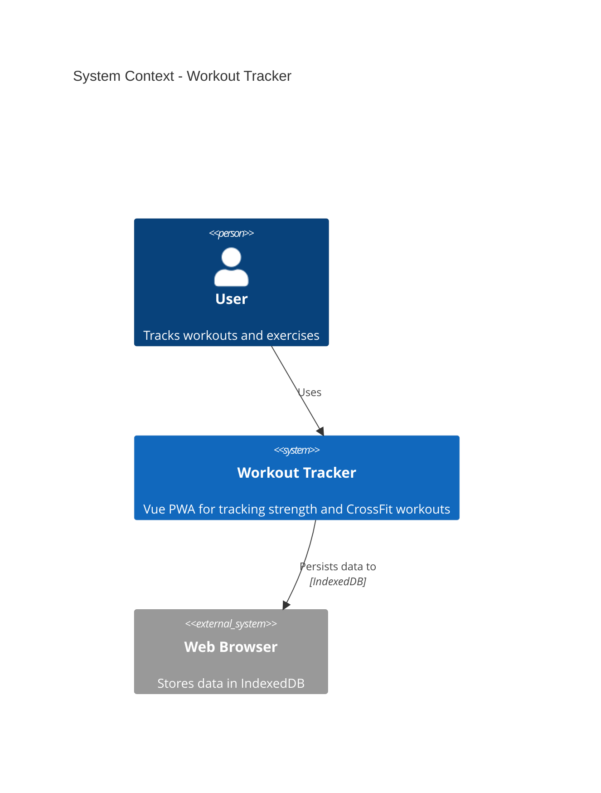
```mermaid
C4Context
  title System Context - Workout Tracker

  Person(user, "User", "Tracks workouts and exercises")
  System(app, "Workout Tracker", "Vue PWA for tracking strength and CrossFit workouts")
  System_Ext(browser, "Web Browser", "Stores data in IndexedDB")

  Rel(user, app, "Uses")
  Rel(app, browser, "Persists data to", "IndexedDB")
```

### Container Diagram (Level 2)
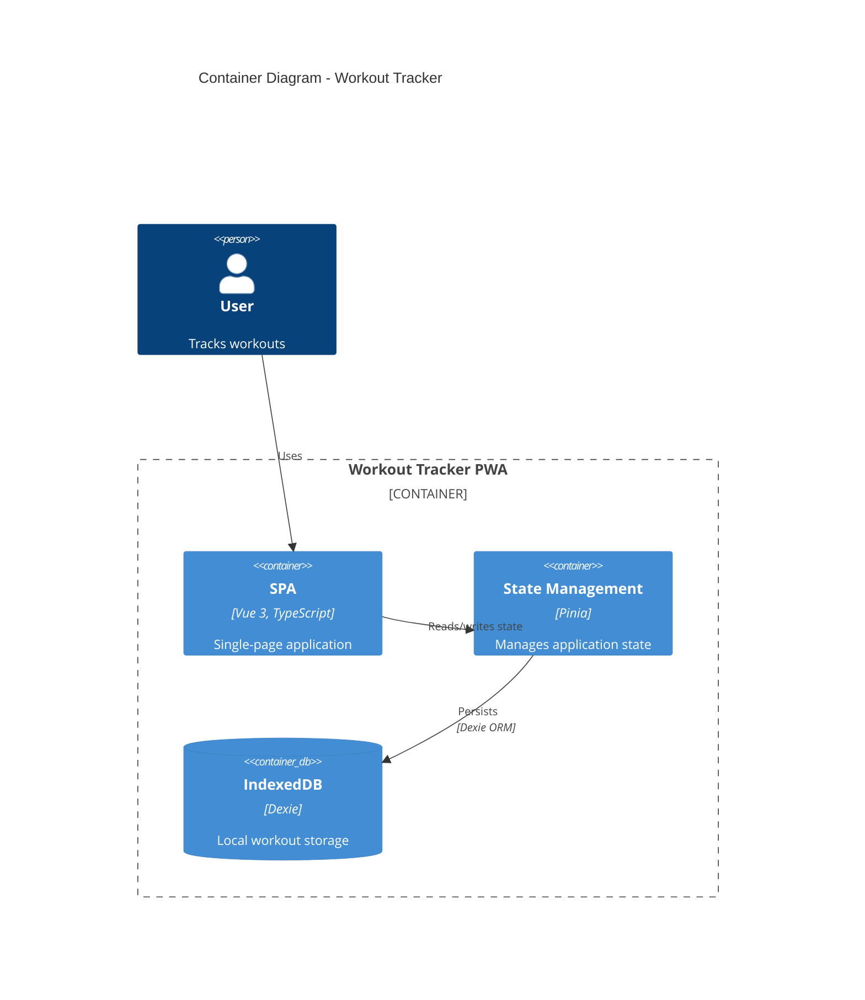
```mermaid
C4Container
  title Container Diagram - Workout Tracker

  Person(user, "User", "Tracks workouts")

  Container_Boundary(app, "Workout Tracker PWA") {
    Container(spa, "SPA", "Vue 3, TypeScript", "Single-page application")
    Container(pinia, "State Management", "Pinia", "Manages application state")
    ContainerDb(indexeddb, "IndexedDB", "Dexie", "Local workout storage")
  }

  Rel(user, spa, "Uses")
  Rel(spa, pinia, "Reads/writes state")
  Rel(pinia, indexeddb, "Persists", "Dexie ORM")
```

### Component Diagram (Level 3)
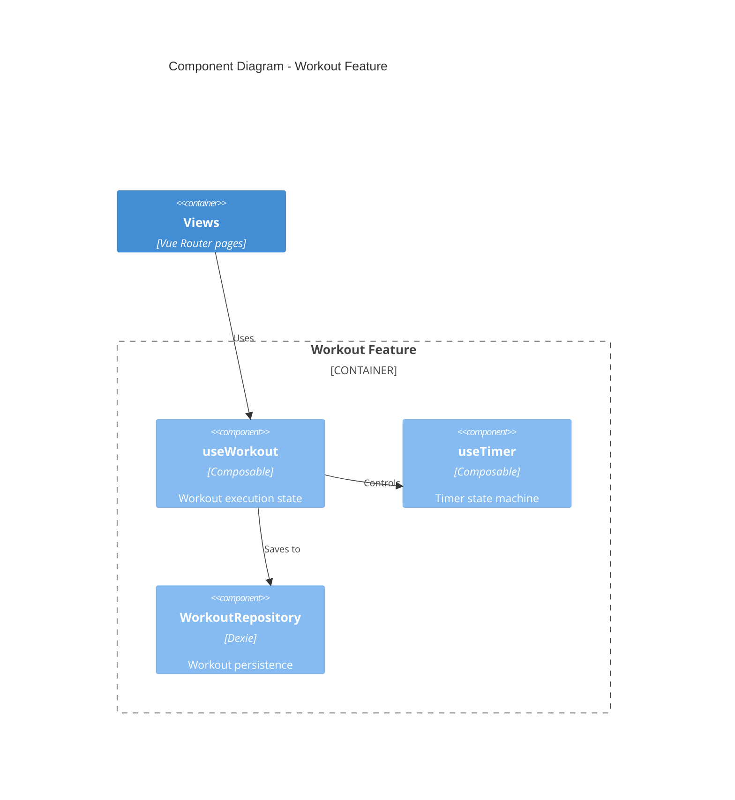
```mermaid
C4Component
  title Component Diagram - Workout Feature

  Container(views, "Views", "Vue Router pages")

  Container_Boundary(workout, "Workout Feature") {
    Component(useWorkout, "useWorkout", "Composable", "Workout execution state")
    Component(useTimer, "useTimer", "Composable", "Timer state machine")
    Component(workoutRepo, "WorkoutRepository", "Dexie", "Workout persistence")
  }

  Rel(views, useWorkout, "Uses")
  Rel(useWorkout, useTimer, "Controls")
  Rel(useWorkout, workoutRepo, "Saves to")
```

### Dynamic Diagram (Request Flow)
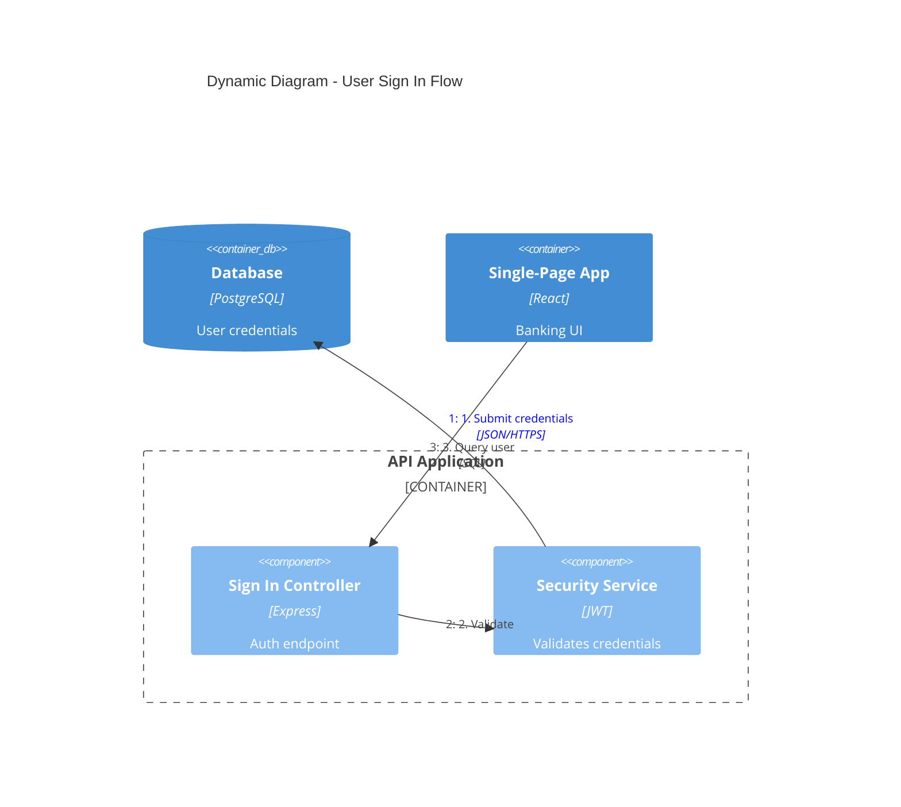
```mermaid
C4Dynamic
  title Dynamic Diagram - User Sign In Flow

  ContainerDb(db, "Database", "PostgreSQL", "User credentials")
  Container(spa, "Single-Page App", "React", "Banking UI")

  Container_Boundary(api, "API Application") {
    Component(signIn, "Sign In Controller", "Express", "Auth endpoint")
    Component(security, "Security Service", "JWT", "Validates credentials")
  }

  Rel(spa, signIn, "1. Submit credentials", "JSON/HTTPS")
  Rel(signIn, security, "2. Validate")
  Rel(security, db, "3. Query user", "SQL")

  UpdateRelStyle(spa, signIn, $textColor="blue", $offsetY="-30")
```

### Deployment Diagram
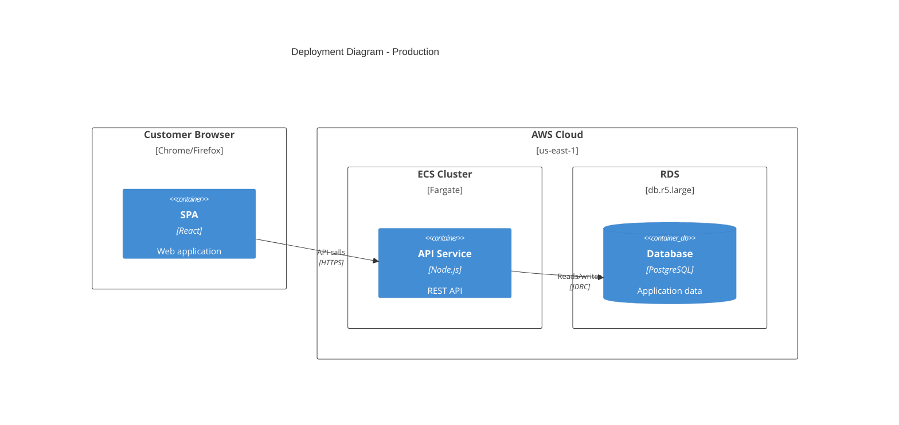
```mermaid
C4Deployment
  title Deployment Diagram - Production

  Deployment_Node(browser, "Customer Browser", "Chrome/Firefox") {
    Container(spa, "SPA", "React", "Web application")
  }

  Deployment_Node(aws, "AWS Cloud", "us-east-1") {
    Deployment_Node(ecs, "ECS Cluster", "Fargate") {
      Container(api, "API Service", "Node.js", "REST API")
    }
    Deployment_Node(rds, "RDS", "db.r5.large") {
      ContainerDb(db, "Database", "PostgreSQL", "Application data")
    }
  }

  Rel(spa, api, "API calls", "HTTPS")
  Rel(api, db, "Reads/writes", "JDBC")
```

## Element Syntax

### People and Systems
```
Person(alias, "Label", "Description")
Person_Ext(alias, "Label", "Description")       # External person
System(alias, "Label", "Description")
System_Ext(alias, "Label", "Description")       # External system
SystemDb(alias, "Label", "Description")         # Database system
SystemQueue(alias, "Label", "Description")      # Queue system
```

### Containers
```
Container(alias, "Label", "Technology", "Description")
Container_Ext(alias, "Label", "Technology", "Description")
ContainerDb(alias, "Label", "Technology", "Description")
ContainerQueue(alias, "Label", "Technology", "Description")
```

### Components
```
Component(alias, "Label", "Technology", "Description")
Component_Ext(alias, "Label", "Technology", "Description")
ComponentDb(alias, "Label", "Technology", "Description")
```

### Boundaries
```
Enterprise_Boundary(alias, "Label") { ... }
System_Boundary(alias, "Label") { ... }
Container_Boundary(alias, "Label") { ... }
Boundary(alias, "Label", "type") { ... }
```

### Relationships
```
Rel(from, to, "Label")
Rel(from, to, "Label", "Technology")
BiRel(from, to, "Label")                        # Bidirectional
Rel_U(from, to, "Label")                        # Upward
Rel_D(from, to, "Label")                        # Downward
Rel_L(from, to, "Label")                        # Leftward
Rel_R(from, to, "Label")                        # Rightward
```

### Deployment Nodes
```
Deployment_Node(alias, "Label", "Type", "Description") { ... }
Node(alias, "Label", "Type", "Description") { ... }  # Shorthand
```

## Styling and Layout

### Layout Configuration
```
UpdateLayoutConfig($c4ShapeInRow="3", $c4BoundaryInRow="1")
```
- `$c4ShapeInRow` - Number of shapes per row (default: 4)
- `$c4BoundaryInRow` - Number of boundaries per row (default: 2)

### Element Styling
```
UpdateElementStyle(alias, $fontColor="red", $bgColor="grey", $borderColor="red")
```

### Relationship Styling
```
UpdateRelStyle(from, to, $textColor="blue", $lineColor="blue", $offsetX="5", $offsetY="-10")
```
Use `$offsetX` and `$offsetY` to fix overlapping relationship labels.

## Best Practices

### Essential Rules

1. **Every element must have**: Name, Type, Technology (where applicable), and Description
2. **Use unidirectional arrows only** - Bidirectional arrows create ambiguity
3. **Label arrows with action verbs** - "Sends email using", "Reads from", not just "uses"
4. **Include technology labels** - "JSON/HTTPS", "JDBC", "gRPC"
5. **Stay under 20 elements per diagram** - Split complex systems into multiple diagrams

### Clarity Guidelines

1. **Start at Level 1** - Context diagrams help frame the system scope
2. **One diagram per file** - Keep diagrams focused on a single abstraction level
3. **Meaningful aliases** - Use descriptive aliases (e.g., `orderService` not `s1`)
4. **Concise descriptions** - Keep descriptions under 50 characters when possible
5. **Always include a title** - "System Context diagram for [System Name]"

### What to Avoid

See [references/common-mistakes.md](references/common-mistakes.md) for detailed anti-patterns:
- Confusing containers (deployable) vs components (non-deployable)
- Modeling shared libraries as containers
- Showing message brokers as single containers instead of individual topics
- Adding undefined abstraction levels like "subcomponents"
- Removing type labels to "simplify" diagrams

## Microservices Guidelines

### Single Team Ownership
Model each microservice as a **container** (or container group):
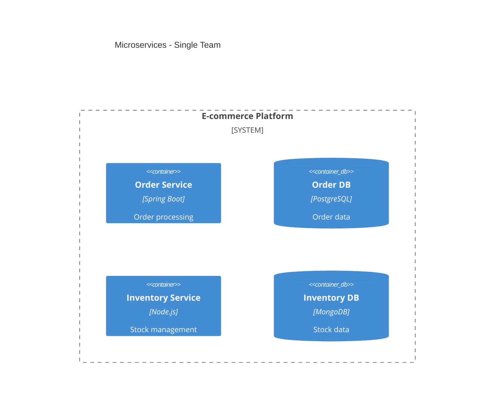
```mermaid
C4Container
  title Microservices - Single Team

  System_Boundary(platform, "E-commerce Platform") {
    Container(orderApi, "Order Service", "Spring Boot", "Order processing")
    ContainerDb(orderDb, "Order DB", "PostgreSQL", "Order data")
    Container(inventoryApi, "Inventory Service", "Node.js", "Stock management")
    ContainerDb(inventoryDb, "Inventory DB", "MongoDB", "Stock data")
  }
```

### Multi-Team Ownership
Promote microservices to **software systems** when owned by separate teams:
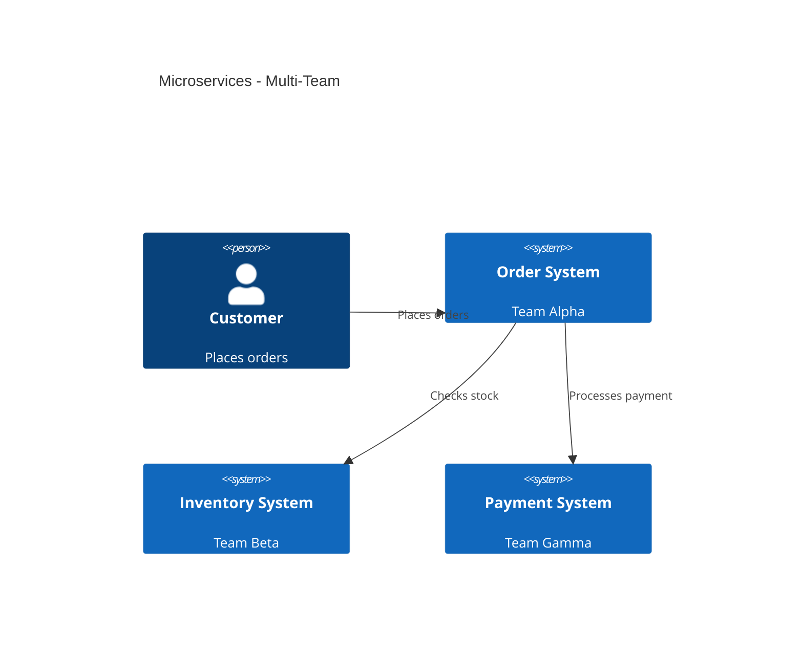
```mermaid
C4Context
  title Microservices - Multi-Team

  Person(customer, "Customer", "Places orders")
  System(orderSystem, "Order System", "Team Alpha")
  System(inventorySystem, "Inventory System", "Team Beta")
  System(paymentSystem, "Payment System", "Team Gamma")

  Rel(customer, orderSystem, "Places orders")
  Rel(orderSystem, inventorySystem, "Checks stock")
  Rel(orderSystem, paymentSystem, "Processes payment")
```

### Event-Driven Architecture
Show individual topics/queues as containers, NOT a single "Kafka" box:
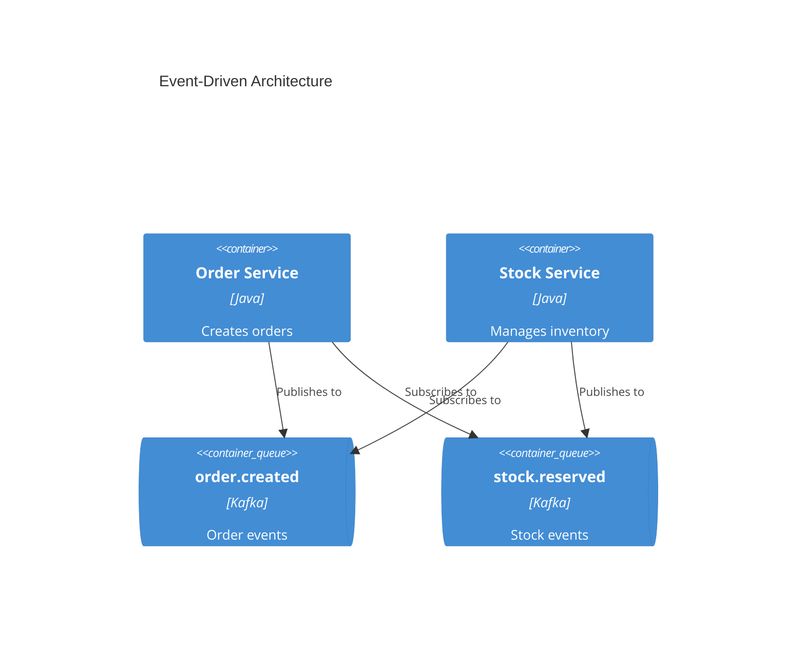
```mermaid
C4Container
  title Event-Driven Architecture

  Container(orderService, "Order Service", "Java", "Creates orders")
  Container(stockService, "Stock Service", "Java", "Manages inventory")
  ContainerQueue(orderTopic, "order.created", "Kafka", "Order events")
  ContainerQueue(stockTopic, "stock.reserved", "Kafka", "Stock events")

  Rel(orderService, orderTopic, "Publishes to")
  Rel(stockService, orderTopic, "Subscribes to")
  Rel(stockService, stockTopic, "Publishes to")
  Rel(orderService, stockTopic, "Subscribes to")
```

## Output Location

Write architecture documentation to `docs/architecture/` with naming convention:
- `c4-context.md` - System context diagram
- `c4-containers.md` - Container diagram
- `c4-components-{feature}.md` - Component diagrams per feature
- `c4-deployment.md` - Deployment diagram
- `c4-dynamic-{flow}.md` - Dynamic diagrams for specific flows

## Audience-Appropriate Detail

| Audience | Recommended Diagrams |
|----------|---------------------|
| Executives | System Context only |
| Product Managers | Context + Container |
| Architects | Context + Container + key Components |
| Developers | All levels as needed |
| DevOps | Container + Deployment |

## References

- [references/c4-syntax.md](references/c4-syntax.md) - Complete Mermaid C4 syntax
- [references/common-mistakes.md](references/common-mistakes.md) - Anti-patterns to avoid
- [references/advanced-patterns.md](references/advanced-patterns.md) - Microservices, event-driven, deployment


---


## 📚 Reference Materials


### Common Mistakes

# Common C4 Model Mistakes to Avoid

This guide documents frequent anti-patterns and errors when creating C4 architecture diagrams, with examples of what to do instead.

## Abstraction Level Mistakes

### 1. Confusing Containers and Components

**The Problem:**
Containers are **deployable units** (applications, services, databases). Components are **non-deployable elements inside a container** (modules, classes, packages).

**Wrong - Java class shown as container:**
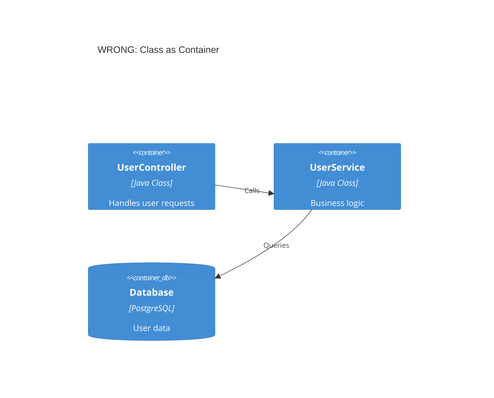
```mermaid
C4Container
  title WRONG: Class as Container

  Container(userController, "UserController", "Java Class", "Handles user requests")
  Container(userService, "UserService", "Java Class", "Business logic")
  ContainerDb(db, "Database", "PostgreSQL", "User data")

  Rel(userController, userService, "Calls")
  Rel(userService, db, "Queries")
```

**Correct - Classes as components inside a container:**
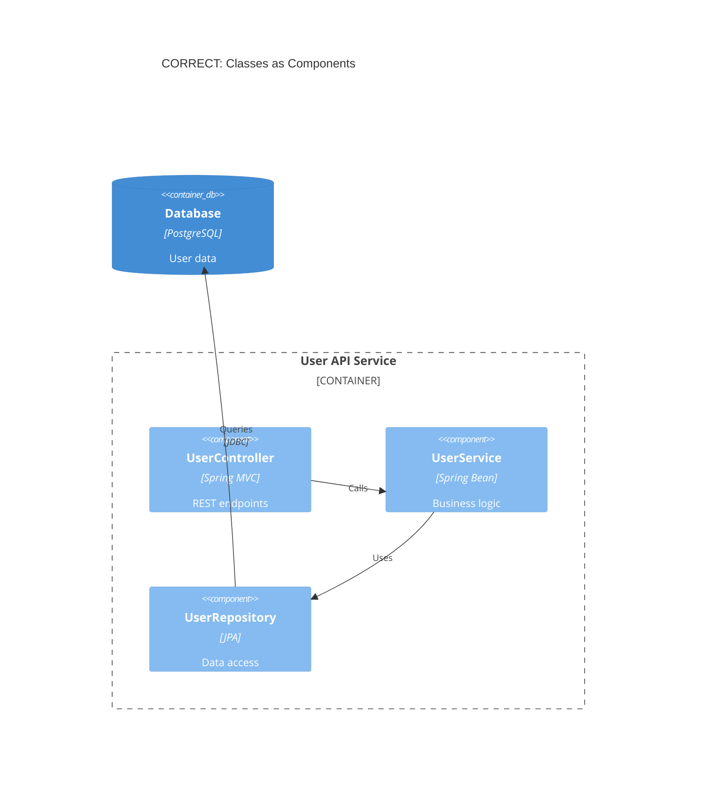
```mermaid
C4Component
  title CORRECT: Classes as Components

  ContainerDb(db, "Database", "PostgreSQL", "User data")

  Container_Boundary(api, "User API Service") {
    Component(userController, "UserController", "Spring MVC", "REST endpoints")
    Component(userService, "UserService", "Spring Bean", "Business logic")
    Component(userRepo, "UserRepository", "JPA", "Data access")
  }

  Rel(userController, userService, "Calls")
  Rel(userService, userRepo, "Uses")
  Rel(userRepo, db, "Queries", "JDBC")
```

### 2. Adding Undefined Abstraction Levels

**The Problem:**
C4 defines exactly four levels. Don't invent "subcomponents", "modules", or other arbitrary levels.

**Wrong:**
- Level 3.5: "Subcomponents"
- Level 2.5: "Microservice groups"
- Custom levels like "packages" or "modules"

**Correct:**
Stick to Person, Software System, Container, Component. If you need more detail, you're at Level 4 (Code) which should use UML class diagrams.

### 3. Vague Subsystems

**The Problem:**
"Subsystem" is ambiguous. Is it a system, container, or component?

**Wrong:**
```
Subsystem(orders, "Order Subsystem", "Handles orders")
```

**Correct - Be specific:**
```
System(orderSystem, "Order System", "Handles order lifecycle")
# OR
Container(orderService, "Order Service", "Java", "Order processing API")
# OR
Component(orderProcessor, "Order Processor", "Spring Bean", "Order business logic")
```

## Shared Libraries Mistake

**The Problem:**
Modeling a shared library as a container implies it's an independently running service. Libraries are copied into applications, not deployed separately.

**Wrong - Library as separate container:**
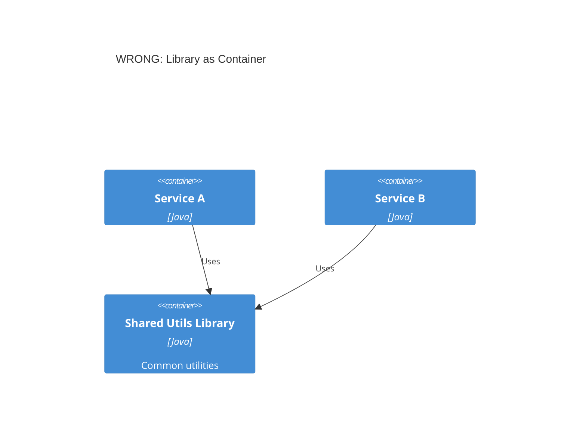
```mermaid
C4Container
  title WRONG: Library as Container

  Container(serviceA, "Service A", "Java")
  Container(serviceB, "Service B", "Java")
  Container(sharedLib, "Shared Utils Library", "Java", "Common utilities")

  Rel(serviceA, sharedLib, "Uses")
  Rel(serviceB, sharedLib, "Uses")
```

**Correct - Show library within each service:**
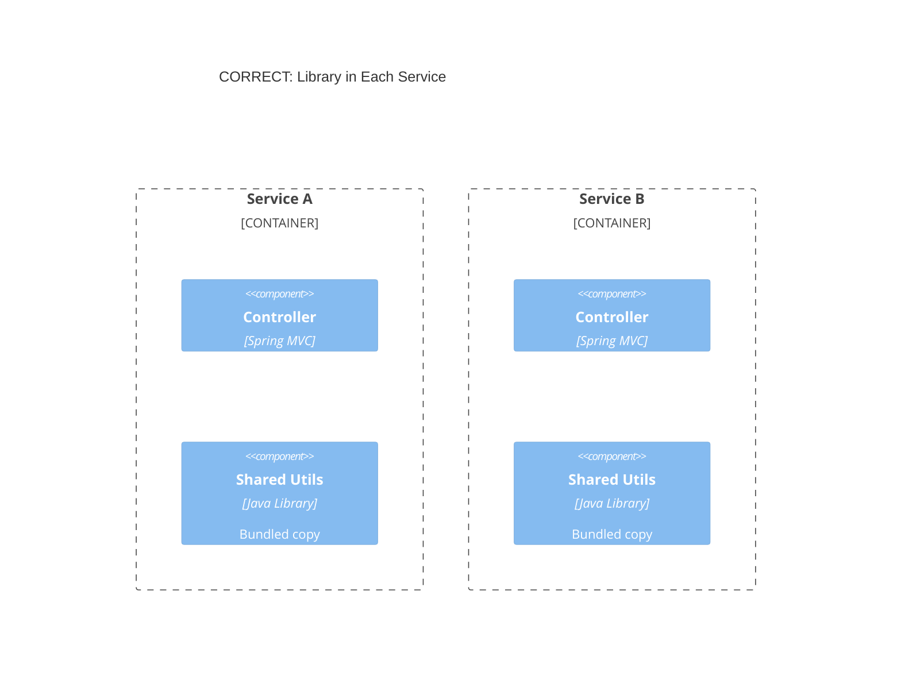
```mermaid
C4Component
  title CORRECT: Library in Each Service

  Container_Boundary(serviceA, "Service A") {
    Component(controllerA, "Controller", "Spring MVC")
    Component(utilsA, "Shared Utils", "Java Library", "Bundled copy")
  }

  Container_Boundary(serviceB, "Service B") {
    Component(controllerB, "Controller", "Spring MVC")
    Component(utilsB, "Shared Utils", "Java Library", "Bundled copy")
  }
```

Or simply omit the library from architecture diagrams since it's an implementation detail.

## Message Broker Mistakes

### Single Message Bus Anti-Pattern

**The Problem:**
Showing Kafka/RabbitMQ as a single container creates a misleading "hub and spoke" diagram that hides actual data flows.

**Wrong - Central message bus:**
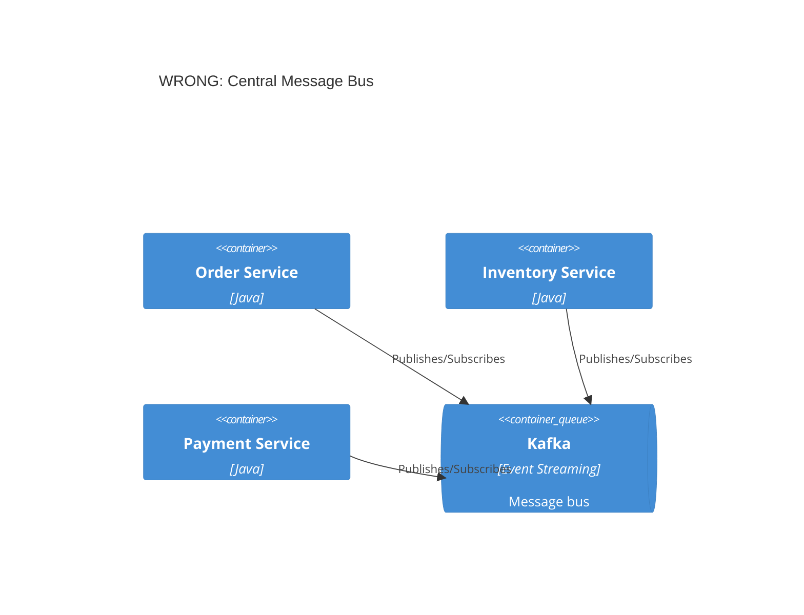
```mermaid
C4Container
  title WRONG: Central Message Bus

  Container(orderSvc, "Order Service", "Java")
  Container(inventorySvc, "Inventory Service", "Java")
  Container(paymentSvc, "Payment Service", "Java")
  ContainerQueue(kafka, "Kafka", "Event Streaming", "Message bus")

  Rel(orderSvc, kafka, "Publishes/Subscribes")
  Rel(inventorySvc, kafka, "Publishes/Subscribes")
  Rel(paymentSvc, kafka, "Publishes/Subscribes")
```

**Correct - Individual topics:**
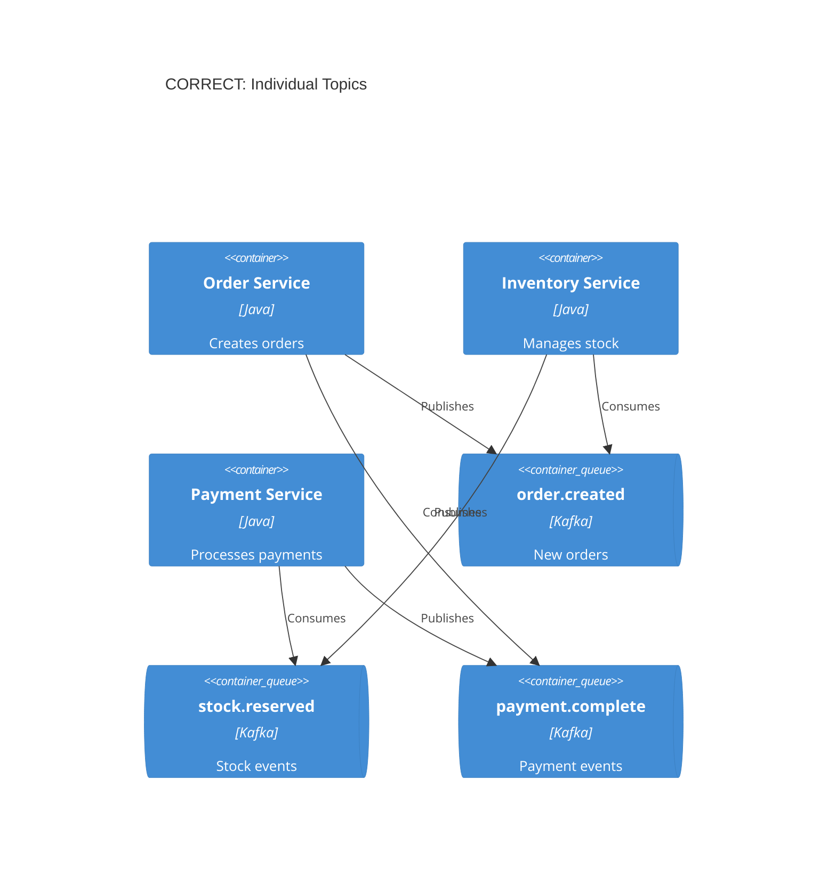
```mermaid
C4Container
  title CORRECT: Individual Topics

  Container(orderSvc, "Order Service", "Java", "Creates orders")
  Container(inventorySvc, "Inventory Service", "Java", "Manages stock")
  Container(paymentSvc, "Payment Service", "Java", "Processes payments")

  ContainerQueue(orderCreated, "order.created", "Kafka", "New orders")
  ContainerQueue(stockReserved, "stock.reserved", "Kafka", "Stock events")
  ContainerQueue(paymentComplete, "payment.complete", "Kafka", "Payment events")

  Rel(orderSvc, orderCreated, "Publishes")
  Rel(inventorySvc, orderCreated, "Consumes")
  Rel(inventorySvc, stockReserved, "Publishes")
  Rel(paymentSvc, stockReserved, "Consumes")
  Rel(paymentSvc, paymentComplete, "Publishes")
  Rel(orderSvc, paymentComplete, "Consumes")
```

**Alternative - Topics on relationship labels:**
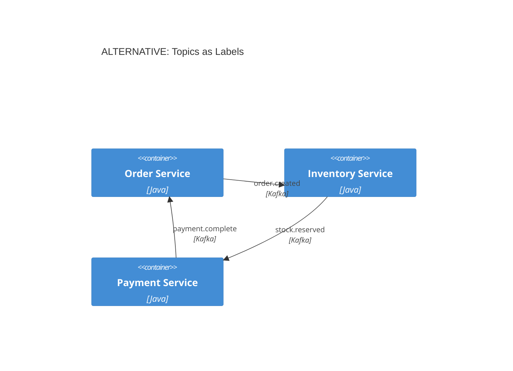
```mermaid
C4Container
  title ALTERNATIVE: Topics as Labels

  Container(orderSvc, "Order Service", "Java")
  Container(inventorySvc, "Inventory Service", "Java")
  Container(paymentSvc, "Payment Service", "Java")

  Rel(orderSvc, inventorySvc, "order.created", "Kafka")
  Rel(inventorySvc, paymentSvc, "stock.reserved", "Kafka")
  Rel(paymentSvc, orderSvc, "payment.complete", "Kafka")
```

## External Systems Mistakes

### Showing Internal Details of External Systems

**The Problem:**
You don't control external systems. Showing their internals creates coupling and becomes stale quickly.

**Wrong - External system internals:**
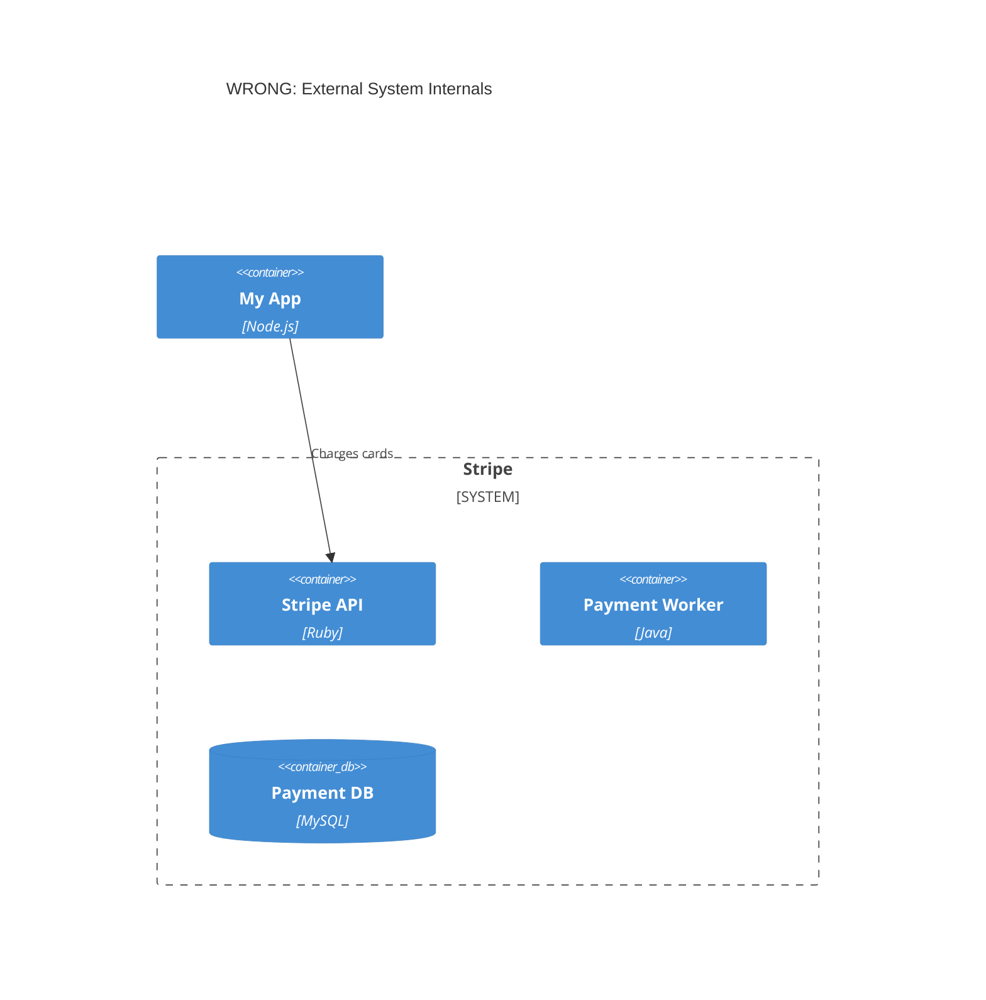
```mermaid
C4Container
  title WRONG: External System Internals

  Container(myApp, "My App", "Node.js")

  System_Boundary(stripe, "Stripe") {
    Container(stripeApi, "Stripe API", "Ruby")
    Container(stripeWorker, "Payment Worker", "Java")
    ContainerDb(stripeDb, "Payment DB", "MySQL")
  }

  Rel(myApp, stripeApi, "Charges cards")
```

**Correct - External system as black box:**
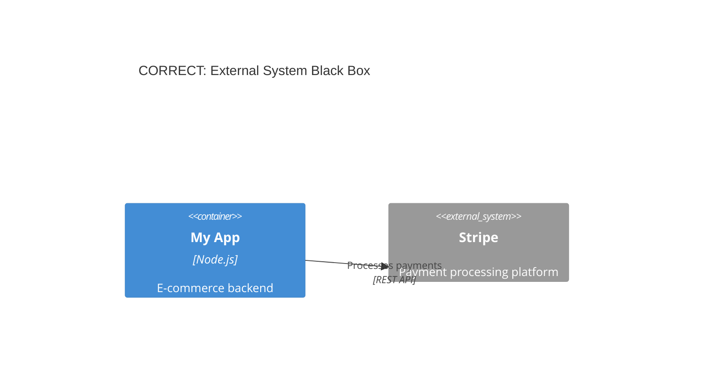
```mermaid
C4Context
  title CORRECT: External System Black Box

  Container(myApp, "My App", "Node.js", "E-commerce backend")
  System_Ext(stripe, "Stripe", "Payment processing platform")

  Rel(myApp, stripe, "Processes payments", "REST API")
```

## Metadata and Documentation Mistakes

### 1. Removing Type Labels

**The Problem:**
Removing element type labels (Container, Component, System) to "simplify" diagrams creates ambiguity.

**Wrong:**
```
Box(api, "API")  # What is this? System? Container? Component?
```

**Correct:**
```
Container(api, "API Application", "Spring Boot", "REST API backend")
```

### 2. Missing Descriptions

**The Problem:**
Elements without descriptions force viewers to guess their purpose.

**Wrong:**
```
Container(svc, "Service", "Java")
```

**Correct:**
```
Container(orderSvc, "Order Service", "Spring Boot", "Manages order lifecycle and fulfillment")
```

### 3. Generic Relationship Labels

**The Problem:**
Labels like "uses" or "communicates with" don't explain what data flows or why.

**Wrong:**
```
Rel(frontend, api, "Uses")
Rel(api, db, "Accesses")
```

**Correct:**
```
Rel(frontend, api, "Fetches products, submits orders", "JSON/HTTPS")
Rel(api, db, "Reads/writes order data", "JDBC")
```

## Diagram Scope Mistakes

### 1. Not Tailoring to Audience

**The Problem:**
Showing Level 4 code diagrams to executives, or only Level 1 to developers who need implementation details.

| Audience | Appropriate Levels |
|----------|-------------------|
| Executives | Level 1 (Context) only |
| Product Managers | Levels 1-2 |
| Architects | Levels 1-3 |
| Developers | All levels as needed |
| DevOps | Levels 2 + Deployment |

### 2. Creating All Four Levels by Default

**The Problem:**
Not every system needs all four levels. Level 3 (Component) and Level 4 (Code) often add no value.

**Guidance:**
- **Always create:** Context (L1) and Container (L2)
- **Create if valuable:** Component (L3) for complex containers
- **Rarely create:** Code (L4) - let IDEs generate these

### 3. Too Many Elements Per Diagram

**The Problem:**
Diagrams with 20+ elements become unreadable.

**Simon Brown's advice:** "If a diagram with a dozen boxes is hard to understand, don't draw a diagram with a dozen boxes!"

**Solutions:**
- Split by bounded context or domain
- Create separate diagrams per service
- Show one service + its direct dependencies
- Use multiple focused diagrams instead of one comprehensive diagram

## Arrow Mistakes

### 1. Bidirectional Arrows

**The Problem:**
Bidirectional arrows are ambiguous. Who initiates the call? What flows each direction?

**Wrong:**
```
BiRel(frontend, api, "Data")  # Ambiguous direction
```

**Correct:**
```
Rel(frontend, api, "Requests products", "JSON/HTTPS")
Rel(api, frontend, "Returns product data", "JSON/HTTPS")
```

Or show the initiator's perspective:
```
Rel(frontend, api, "Fetches products", "JSON/HTTPS")
```

### 2. Unlabeled Arrows

**The Problem:**
Arrows without labels force readers to guess what flows between elements.

**Wrong:**
```
Rel(orderSvc, paymentSvc)
```

**Correct:**
```
Rel(orderSvc, paymentSvc, "Requests payment authorization", "gRPC")
```

## Deployment Diagram Mistakes

### 1. Deployment Details in Container Diagrams

**The Problem:**
Container diagrams should show logical architecture, not infrastructure details.

**Wrong - Infrastructure in container diagram:**
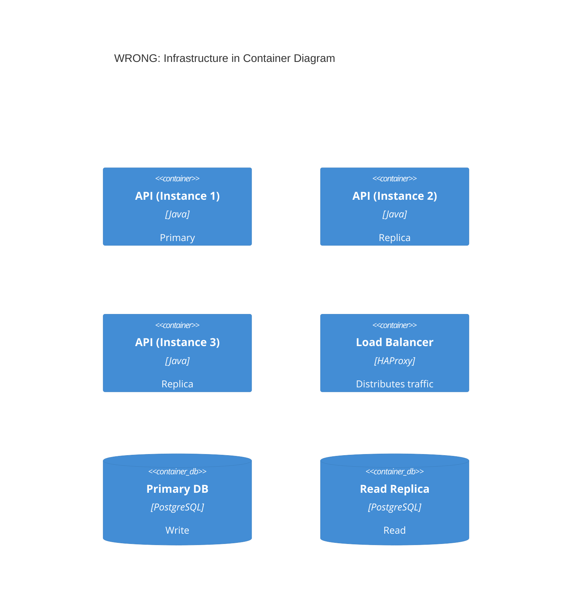
```mermaid
C4Container
  title WRONG: Infrastructure in Container Diagram

  Container(api1, "API (Instance 1)", "Java", "Primary")
  Container(api2, "API (Instance 2)", "Java", "Replica")
  Container(api3, "API (Instance 3)", "Java", "Replica")
  Container(lb, "Load Balancer", "HAProxy", "Distributes traffic")
  ContainerDb(primary, "Primary DB", "PostgreSQL", "Write")
  ContainerDb(replica, "Read Replica", "PostgreSQL", "Read")
```

**Correct - Use Deployment diagram for infrastructure:**
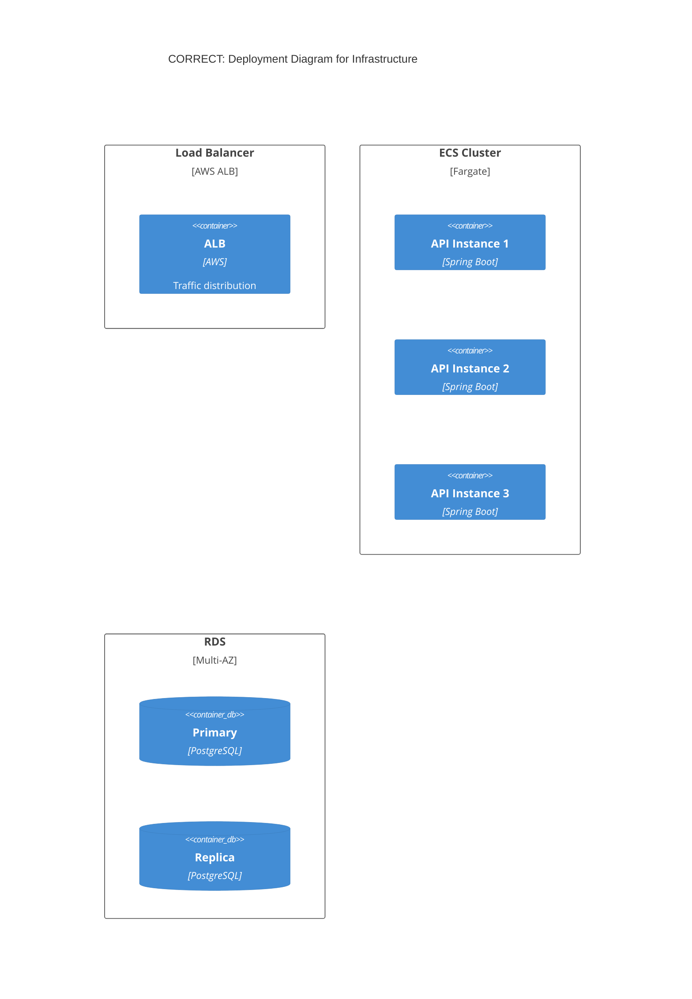
```mermaid
C4Deployment
  title CORRECT: Deployment Diagram for Infrastructure

  Deployment_Node(lb, "Load Balancer", "AWS ALB") {
    Container(alb, "ALB", "AWS", "Traffic distribution")
  }

  Deployment_Node(ecs, "ECS Cluster", "Fargate") {
    Container(api1, "API Instance 1", "Spring Boot")
    Container(api2, "API Instance 2", "Spring Boot")
    Container(api3, "API Instance 3", "Spring Boot")
  }

  Deployment_Node(rds, "RDS", "Multi-AZ") {
    ContainerDb(primary, "Primary", "PostgreSQL")
    ContainerDb(replica, "Replica", "PostgreSQL")
  }
```

### 2. Missing Environment Context

**The Problem:**
Deployment diagrams should specify which environment (production, staging, dev).

**Wrong:**
```
C4Deployment
  title Deployment Diagram  # Which environment?
```

**Correct:**
```
C4Deployment
  title Deployment Diagram - Production (AWS us-east-1)
```

## Consistency Mistakes

### 1. Inconsistent Notation Across Diagrams

**The Problem:**
Using different colors, shapes, or terminology for the same elements across diagrams.

**Wrong:**
- Context diagram: "Payment System" (blue)
- Container diagram: "Payment Service" (green)
- Component diagram: "Payment Module" (red)

**Correct:**
Use consistent naming, colors, and styling. Create a style guide for your team.

### 2. No Legend/Key

**The Problem:**
Assuming viewers understand your notation without explanation.

**Solution:**
Always include a legend explaining colors, shapes, and line styles. Even for "obvious" elements.

## Decision Documentation Mistakes

### Showing Decision Process in Diagrams

**The Problem:**
Architecture diagrams show **outcomes** of decisions, not the decision-making process.

**Wrong approach:**
Including "Option A vs Option B" annotations in diagrams.

**Correct approach:**
- Document decisions separately in Architecture Decision Records (ADRs)
- Link ADRs to relevant diagrams
- Diagrams show the chosen architecture, ADRs explain why

## Quick Reference: Checklist

Before finalizing any C4 diagram, verify:

- [ ] Every element has: name, type, technology (if applicable), description
- [ ] All arrows are unidirectional with action verb labels
- [ ] Technology/protocol included on relationships
- [ ] Diagram has a clear, specific title
- [ ] Under 20 elements (ideally under 15)
- [ ] Appropriate level for the target audience
- [ ] Containers are deployable, components are not
- [ ] External systems shown as black boxes
- [ ] Message topics shown individually (not as single broker)
- [ ] No infrastructure details in container diagrams
- [ ] Consistent with other diagrams in the set


### Advanced Patterns

# Advanced C4 Architecture Patterns

This guide covers advanced patterns for documenting complex architectures including microservices, event-driven systems, deployments, and API documentation.

## Microservices Architecture

### Single Team Ownership

When one team owns all microservices, model them as **containers** within a single system:

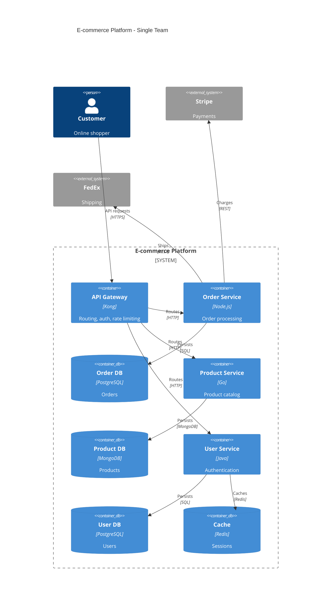
```mermaid
C4Container
  title E-commerce Platform - Single Team

  Person(customer, "Customer", "Online shopper")

  System_Ext(payment, "Stripe", "Payments")
  System_Ext(shipping, "FedEx", "Shipping")

  System_Boundary(platform, "E-commerce Platform") {
    Container(gateway, "API Gateway", "Kong", "Routing, auth, rate limiting")

    Container(orderSvc, "Order Service", "Node.js", "Order processing")
    ContainerDb(orderDb, "Order DB", "PostgreSQL", "Orders")

    Container(productSvc, "Product Service", "Go", "Product catalog")
    ContainerDb(productDb, "Product DB", "MongoDB", "Products")

    Container(userSvc, "User Service", "Java", "Authentication")
    ContainerDb(userDb, "User DB", "PostgreSQL", "Users")
    ContainerDb(cache, "Cache", "Redis", "Sessions")
  }

  Rel(customer, gateway, "API requests", "HTTPS")
  Rel(gateway, orderSvc, "Routes", "HTTP")
  Rel(gateway, productSvc, "Routes", "HTTP")
  Rel(gateway, userSvc, "Routes", "HTTP")

  Rel(orderSvc, orderDb, "Persists", "SQL")
  Rel(productSvc, productDb, "Persists", "MongoDB")
  Rel(userSvc, userDb, "Persists", "SQL")
  Rel(userSvc, cache, "Caches", "Redis")

  Rel(orderSvc, payment, "Charges", "REST")
  Rel(orderSvc, shipping, "Ships", "REST")
```

### Multi-Team Ownership

When separate teams own microservices, **promote each to a software system**:

```mermaid
C4Context
  title E-commerce Platform - Multi-Team

  Person(customer, "Customer", "Online shopper")
  Person(admin, "Admin", "Store manager")

  Enterprise_Boundary(company, "Acme Corp") {
    System(orderSystem, "Order System", "Team Alpha - Order lifecycle")
    System(productSystem, "Product System", "Team Beta - Catalog management")
    System(userSystem, "User System", "Team Gamma - Identity & auth")
    System(analyticsSystem, "Analytics System", "Team Delta - Business intelligence")
  }

  System_Ext(payment, "Stripe", "Payment processing")
  System_Ext(warehouse, "Warehouse System", "Fulfillment partner")

  Rel(customer, orderSystem, "Places orders")
  Rel(customer, productSystem, "Browses products")
  Rel(admin, productSystem, "Manages catalog")
  Rel(admin, analyticsSystem, "Views reports")

  Rel(orderSystem, userSystem, "Authenticates")
  Rel(orderSystem, productSystem, "Checks inventory")
  Rel(orderSystem, payment, "Processes payments")
  Rel(orderSystem, warehouse, "Fulfills orders")
  Rel(analyticsSystem, orderSystem, "Aggregates data")
```

Each team then creates their own Container diagram:

```mermaid
C4Container
  title Order System - Team Alpha

  System_Ext(productSystem, "Product System", "Inventory checks")
  System_Ext(userSystem, "User System", "Authentication")
  System_Ext(payment, "Stripe", "Payments")

  Container_Boundary(orderSystem, "Order System") {
    Container(orderApi, "Order API", "Spring Boot", "REST endpoints")
    Container(orderWorker, "Order Worker", "Spring Boot", "Async processing")
    ContainerDb(orderDb, "Order DB", "PostgreSQL", "Order data")
    ContainerQueue(orderQueue, "Order Queue", "RabbitMQ", "Processing queue")
  }

  Rel(orderApi, orderDb, "Reads/writes", "JDBC")
  Rel(orderApi, orderQueue, "Publishes", "AMQP")
  Rel(orderWorker, orderQueue, "Consumes", "AMQP")
  Rel(orderWorker, orderDb, "Updates", "JDBC")

  Rel(orderApi, userSystem, "Validates tokens", "REST")
  Rel(orderApi, productSystem, "Reserves stock", "REST")
  Rel(orderWorker, payment, "Charges", "REST")
```

## Event-Driven Architecture

### Showing Individual Topics

Always model message topics/queues as separate containers:

```mermaid
C4Container
  title Order Processing - Event-Driven

  Container(orderSvc, "Order Service", "Java", "Creates orders")
  Container(inventorySvc, "Inventory Service", "Go", "Manages stock")
  Container(paymentSvc, "Payment Service", "Node.js", "Processes payments")
  Container(shippingSvc, "Shipping Service", "Python", "Creates shipments")
  Container(notificationSvc, "Notification Service", "Python", "Sends alerts")

  ContainerQueue(orderCreated, "order.created", "Kafka", "New order events")
  ContainerQueue(stockReserved, "inventory.reserved", "Kafka", "Stock reservation events")
  ContainerQueue(paymentComplete, "payment.completed", "Kafka", "Payment events")
  ContainerQueue(orderShipped, "order.shipped", "Kafka", "Shipment events")

  Rel(orderSvc, orderCreated, "Publishes", "Avro")

  Rel(inventorySvc, orderCreated, "Consumes", "Avro")
  Rel(inventorySvc, stockReserved, "Publishes", "Avro")

  Rel(paymentSvc, stockReserved, "Consumes", "Avro")
  Rel(paymentSvc, paymentComplete, "Publishes", "Avro")

  Rel(shippingSvc, paymentComplete, "Consumes", "Avro")
  Rel(shippingSvc, orderShipped, "Publishes", "Avro")

  Rel(notificationSvc, orderCreated, "Consumes", "Avro")
  Rel(notificationSvc, paymentComplete, "Consumes", "Avro")
  Rel(notificationSvc, orderShipped, "Consumes", "Avro")

  Rel(orderSvc, paymentComplete, "Consumes", "Avro")
  Rel(orderSvc, orderShipped, "Consumes", "Avro")

  UpdateLayoutConfig($c4ShapeInRow="4")
```

### Event Flow with Dynamic Diagram

Use Dynamic diagrams to show the sequence of events:

```mermaid
C4Dynamic
  title Order Processing Flow

  Container(orderSvc, "Order Service", "Java")
  Container(inventorySvc, "Inventory Service", "Go")
  Container(paymentSvc, "Payment Service", "Node.js")
  Container(shippingSvc, "Shipping Service", "Python")

  ContainerQueue(orderCreated, "order.created", "Kafka")
  ContainerQueue(stockReserved, "inventory.reserved", "Kafka")
  ContainerQueue(paymentComplete, "payment.completed", "Kafka")

  Rel(orderSvc, orderCreated, "1. Publishes order", "Avro")
  Rel(inventorySvc, orderCreated, "2. Consumes order", "Avro")
  Rel(inventorySvc, stockReserved, "3. Publishes reservation", "Avro")
  Rel(paymentSvc, stockReserved, "4. Consumes reservation", "Avro")
  Rel(paymentSvc, paymentComplete, "5. Publishes payment", "Avro")
  Rel(shippingSvc, paymentComplete, "6. Consumes payment", "Avro")
```

### CQRS Pattern

```mermaid
C4Container
  title CQRS Architecture

  Person(user, "User", "Application user")

  Container_Boundary(app, "Application") {
    Container(commandApi, "Command API", "Java", "Write operations")
    Container(queryApi, "Query API", "Node.js", "Read operations")

    ContainerDb(writeDb, "Write DB", "PostgreSQL", "Source of truth")
    ContainerDb(readDb, "Read DB", "Elasticsearch", "Query-optimized")

    ContainerQueue(events, "Domain Events", "Kafka", "State changes")
    Container(projector, "Projector", "Java", "Updates read model")
  }

  Rel(user, commandApi, "Commands", "HTTPS")
  Rel(user, queryApi, "Queries", "HTTPS")

  Rel(commandApi, writeDb, "Writes", "JDBC")
  Rel(commandApi, events, "Publishes", "Avro")

  Rel(projector, events, "Consumes", "Avro")
  Rel(projector, readDb, "Updates", "REST")

  Rel(queryApi, readDb, "Queries", "REST")
```

## Deployment Patterns

### AWS Production Deployment

```mermaid
C4Deployment
  title Production - AWS us-east-1

  Deployment_Node(route53, "Route 53", "DNS") {
    Container(dns, "DNS", "AWS", "api.example.com")
  }

  Deployment_Node(cloudfront, "CloudFront", "CDN") {
    Container(cdn, "CDN", "AWS", "Static asset caching")
  }

  Deployment_Node(vpc, "VPC", "10.0.0.0/16") {

    Deployment_Node(public, "Public Subnets", "Multi-AZ") {
      Deployment_Node(alb, "ALB", "Application LB") {
        Container(lb, "Load Balancer", "AWS ALB", "TLS termination, routing")
      }
    }

    Deployment_Node(private, "Private Subnets", "Multi-AZ") {

      Deployment_Node(ecs, "ECS Cluster", "Fargate") {
        Container(api1, "API", "Node.js", "Instance 1")
        Container(api2, "API", "Node.js", "Instance 2")
        Container(worker1, "Worker", "Python", "Instance 1")
      }

      Deployment_Node(rds, "RDS", "db.r5.xlarge") {
        ContainerDb(primary, "Primary", "PostgreSQL 14", "Multi-AZ")
      }

      Deployment_Node(elasticache, "ElastiCache", "cache.r5.large") {
        ContainerDb(redis, "Redis", "Redis 7", "Cluster mode")
      }
    }
  }

  Rel(dns, cdn, "Routes to", "HTTPS")
  Rel(cdn, lb, "Forwards", "HTTPS")
  Rel(lb, api1, "Routes", "HTTP")
  Rel(lb, api2, "Routes", "HTTP")
  Rel(api1, primary, "Queries", "JDBC")
  Rel(api2, primary, "Queries", "JDBC")
  Rel(api1, redis, "Caches", "Redis")
  Rel(worker1, primary, "Processes", "JDBC")
```

### Kubernetes Deployment

```mermaid
C4Deployment
  title Production - Kubernetes

  Deployment_Node(ingress, "Ingress Controller", "nginx") {
    Container(nginx, "Nginx", "nginx-ingress", "TLS, routing")
  }

  Deployment_Node(cluster, "Kubernetes Cluster", "EKS 1.28") {

    Deployment_Node(nsApp, "app namespace", "Application") {

      Deployment_Node(apiDeploy, "api-deployment", "3 replicas") {
        Container(api, "API Pod", "Node.js 20", "REST API")
      }

      Deployment_Node(workerDeploy, "worker-deployment", "2 replicas") {
        Container(worker, "Worker Pod", "Python 3.11", "Background jobs")
      }
    }

    Deployment_Node(nsData, "data namespace", "Databases") {

      Deployment_Node(pgStateful, "postgres-statefulset", "HA") {
        ContainerDb(pg, "PostgreSQL", "PostgreSQL 15", "Primary + Replica")
      }

      Deployment_Node(redisStateful, "redis-statefulset", "Cluster") {
        ContainerDb(redis, "Redis", "Redis 7", "3 node cluster")
      }
    }
  }

  Rel(nginx, api, "Routes /api/*", "HTTP")
  Rel(api, pg, "Queries", "JDBC")
  Rel(api, redis, "Caches", "Redis")
  Rel(worker, pg, "Processes", "JDBC")
```

### Multi-Region Deployment

```mermaid
C4Deployment
  title Multi-Region Active-Active

  Deployment_Node(globalLB, "Global Load Balancer", "AWS Global Accelerator") {
    Container(glb, "GLB", "AWS", "Geographic routing")
  }

  Deployment_Node(usEast, "US-East-1", "Primary Region") {
    Deployment_Node(usEcs, "ECS Cluster", "Fargate") {
      Container(usApi, "API", "Node.js", "US instances")
    }
    Deployment_Node(usRds, "RDS", "Multi-AZ") {
      ContainerDb(usPrimary, "Primary DB", "PostgreSQL", "Write leader")
    }
  }

  Deployment_Node(euWest, "EU-West-1", "Secondary Region") {
    Deployment_Node(euEcs, "ECS Cluster", "Fargate") {
      Container(euApi, "API", "Node.js", "EU instances")
    }
    Deployment_Node(euRds, "RDS", "Read Replica") {
      ContainerDb(euReplica, "Replica DB", "PostgreSQL", "Read replica")
    }
  }

  Rel(glb, usApi, "US traffic", "HTTPS")
  Rel(glb, euApi, "EU traffic", "HTTPS")
  Rel(usApi, usPrimary, "Reads/writes", "JDBC")
  Rel(euApi, euReplica, "Reads", "JDBC")
  Rel(euApi, usPrimary, "Writes", "JDBC")
  Rel(usPrimary, euReplica, "Replicates", "Streaming")
```

## API Documentation Patterns

### API Gateway Pattern

```mermaid
C4Container
  title API Gateway Architecture

  Person(mobile, "Mobile User", "iOS/Android app user")
  Person(web, "Web User", "Browser user")
  Person(partner, "Partner", "Third-party integration")

  Container(mobileApp, "Mobile App", "React Native", "Native mobile client")
  Container(webApp, "Web App", "React", "SPA client")

  Container_Boundary(apiPlatform, "API Platform") {
    Container(gateway, "API Gateway", "Kong", "Auth, rate limit, routing")
    Container(bff, "BFF", "Node.js", "Backend for frontend")

    Container(userApi, "User API", "Java", "User management")
    Container(orderApi, "Order API", "Go", "Order processing")
    Container(productApi, "Product API", "Python", "Product catalog")
  }

  System_Ext(auth0, "Auth0", "Identity provider")

  Rel(mobile, mobileApp, "Uses")
  Rel(web, webApp, "Uses")
  Rel(partner, gateway, "API calls", "REST/HTTPS")

  Rel(mobileApp, bff, "GraphQL", "HTTPS")
  Rel(webApp, bff, "GraphQL", "HTTPS")

  Rel(bff, gateway, "REST calls", "HTTP")
  Rel(gateway, auth0, "Validates tokens", "HTTPS")

  Rel(gateway, userApi, "Routes /users/*", "HTTP")
  Rel(gateway, orderApi, "Routes /orders/*", "HTTP")
  Rel(gateway, productApi, "Routes /products/*", "HTTP")
```

### API Component Detail

```mermaid
C4Component
  title Order API - Component Diagram

  Container(gateway, "API Gateway", "Kong")
  ContainerDb(db, "Order DB", "PostgreSQL")
  ContainerQueue(events, "Order Events", "Kafka")
  System_Ext(payment, "Payment Service", "Stripe")

  Container_Boundary(orderApi, "Order API") {
    Component(controller, "Order Controller", "Spring MVC", "REST endpoints")
    Component(validator, "Request Validator", "Bean Validation", "Input validation")
    Component(service, "Order Service", "Spring Service", "Business logic")
    Component(paymentClient, "Payment Client", "Feign", "Stripe integration")
    Component(repository, "Order Repository", "Spring Data JPA", "Data access")
    Component(publisher, "Event Publisher", "Spring Kafka", "Event publishing")
  }

  Rel(gateway, controller, "HTTP requests", "JSON")
  Rel(controller, validator, "Validates")
  Rel(controller, service, "Delegates")
  Rel(service, paymentClient, "Charges")
  Rel(service, repository, "Persists")
  Rel(service, publisher, "Publishes events")

  Rel(paymentClient, payment, "REST", "HTTPS")
  Rel(repository, db, "JDBC", "SQL")
  Rel(publisher, events, "Produces", "Avro")
```

## Supplementary Diagram Patterns

### Authentication Flow (Dynamic)

```mermaid
C4Dynamic
  title OAuth2 Authorization Code Flow

  Container(spa, "SPA", "React", "Web application")
  Container(api, "API", "Node.js", "Resource server")
  System_Ext(auth0, "Auth0", "Authorization server")
  ContainerDb(db, "User DB", "PostgreSQL", "User data")

  Rel(spa, auth0, "1. Redirect to /authorize")
  Rel(auth0, spa, "2. Redirect with auth code")
  Rel(spa, api, "3. Exchange code for tokens", "HTTPS")
  Rel(api, auth0, "4. POST /oauth/token", "HTTPS")
  Rel(api, spa, "5. Return access + refresh tokens")
  Rel(spa, api, "6. API request with access token", "HTTPS")
  Rel(api, db, "7. Fetch user data", "SQL")
```

### Error Handling Flow

```mermaid
C4Dynamic
  title Error Handling - Circuit Breaker

  Container(api, "API", "Node.js")
  Container(circuitBreaker, "Circuit Breaker", "Resilience4j")
  System_Ext(payment, "Payment Service", "Stripe")
  ContainerDb(fallback, "Fallback Cache", "Redis")

  Rel(api, circuitBreaker, "1. Request payment")
  Rel(circuitBreaker, payment, "2. Forward request", "HTTPS")
  Rel(payment, circuitBreaker, "3a. Success response")
  Rel(circuitBreaker, api, "4a. Return success")

  Rel(payment, circuitBreaker, "3b. Timeout/Error")
  Rel(circuitBreaker, fallback, "4b. Check cached response")
  Rel(circuitBreaker, api, "5b. Return fallback or error")
```

## Architecture Decision Record Integration

Link C4 diagrams to Architecture Decision Records (ADRs):

### ADR Reference in Diagrams

```mermaid
C4Container
  title System Architecture
  %% See ADR-001 for API Gateway selection
  %% See ADR-002 for database choice
  %% See ADR-003 for event-driven approach

  Container(gateway, "API Gateway", "Kong", "ADR-001: Selected for plugin ecosystem")
  Container(api, "Order API", "Spring Boot", "Order processing")
  ContainerDb(db, "Order DB", "PostgreSQL", "ADR-002: ACID compliance required")
  ContainerQueue(events, "Events", "Kafka", "ADR-003: Event sourcing pattern")

  Rel(gateway, api, "Routes", "HTTP")
  Rel(api, db, "Persists", "JDBC")
  Rel(api, events, "Publishes", "Avro")
```

### Directory Structure

Organize C4 diagrams with ADRs:

```
docs/
├── architecture/
│   ├── c4-context.md
│   ├── c4-containers.md
│   ├── c4-components-order-api.md
│   ├── c4-deployment-production.md
│   └── c4-dynamic-auth-flow.md
└── decisions/
    ├── 001-api-gateway-selection.md
    ├── 002-database-selection.md
    ├── 003-event-driven-architecture.md
    └── template.md
```

## System Landscape Diagram

For enterprise-level views showing multiple systems:

```mermaid
C4Context
  title Enterprise System Landscape

  Person(customer, "Customer", "External customer")
  Person(employee, "Employee", "Internal staff")
  Person(partner, "Partner", "Business partner")

  Enterprise_Boundary(enterprise, "Acme Corporation") {

    Boundary(customerFacing, "Customer-Facing", "External") {
      System(ecommerce, "E-commerce Platform", "Online store")
      System(mobile, "Mobile App", "Customer mobile experience")
      System(support, "Support Portal", "Customer service")
    }

    Boundary(internal, "Internal Systems", "Operations") {
      System(erp, "ERP System", "SAP - Finance & operations")
      System(crm, "CRM System", "Salesforce - Customer data")
      System(analytics, "Analytics Platform", "Business intelligence")
    }

    Boundary(integration, "Integration Layer", "Middleware") {
      System(esb, "Integration Hub", "MuleSoft - API management")
      System(etl, "Data Pipeline", "Airflow - Data processing")
    }
  }

  System_Ext(payment, "Payment Gateway", "Stripe")
  System_Ext(shipping, "Shipping Provider", "FedEx")
  System_Ext(warehouse, "Warehouse System", "3PL Partner")

  Rel(customer, ecommerce, "Shops online")
  Rel(customer, mobile, "Uses app")
  Rel(customer, support, "Gets help")
  Rel(employee, erp, "Manages operations")
  Rel(employee, crm, "Manages customers")
  Rel(partner, esb, "API integration")

  Rel(ecommerce, esb, "API calls")
  Rel(esb, erp, "Syncs orders")
  Rel(esb, crm, "Syncs customers")
  Rel(esb, payment, "Processes payments")
  Rel(esb, shipping, "Creates shipments")
  Rel(etl, analytics, "Feeds data")
```

## Best Practices Summary

1. **Choose abstraction based on ownership**: Single team = containers, Multi-team = systems
2. **Show individual message topics**: Not a single "Kafka" or "RabbitMQ" box
3. **Use deployment diagrams for infrastructure**: Keep container diagrams logical
4. **Create dynamic diagrams for complex flows**: Authentication, payment, error handling
5. **Link to ADRs**: Document why decisions were made
6. **Use system landscape for enterprise views**: Show all systems and their relationships
7. **Keep diagrams focused**: One concern per diagram, split when complex


### C4 Syntax

# C4 Mermaid Diagram Syntax Reference

Complete syntax reference for Mermaid C4 diagrams. Compatible with PlantUML C4 syntax.

## Table of Contents

1. [Diagram Types](#diagram-types)
2. [System Context Elements](#system-context-elements)
3. [Container Elements](#container-elements)
4. [Component Elements](#component-elements)
5. [Deployment Elements](#deployment-elements)
6. [Relationship Types](#relationship-types)
7. [Boundaries](#boundaries)
8. [Styling](#styling)
9. [Layout Configuration](#layout-configuration)
10. [Parameter Syntax](#parameter-syntax)
11. [Complete Examples](#complete-examples)
12. [Mermaid Limitations](#mermaid-limitations)

## Diagram Types

Start each diagram with the appropriate type declaration:

| Type | Declaration | Purpose |
|------|-------------|---------|
| System Context | `C4Context` | Shows system in context with users and external systems |
| Container | `C4Container` | Shows high-level technical building blocks |
| Component | `C4Component` | Shows internal components within a container |
| Dynamic | `C4Dynamic` | Shows request flows with numbered sequence |
| Deployment | `C4Deployment` | Shows infrastructure and deployment nodes |

## System Context Elements

### Person
```
Person(alias, label, ?descr)
Person_Ext(alias, label, ?descr)    # External person
```

### System
```
System(alias, label, ?descr)
System_Ext(alias, label, ?descr)    # External system
SystemDb(alias, label, ?descr)      # Database system
SystemDb_Ext(alias, label, ?descr)  # External database
SystemQueue(alias, label, ?descr)   # Message queue
SystemQueue_Ext(alias, label, ?descr)
```

## Container Elements

### Container
```
Container(alias, label, ?techn, ?descr)
Container_Ext(alias, label, ?techn, ?descr)
ContainerDb(alias, label, ?techn, ?descr)
ContainerDb_Ext(alias, label, ?techn, ?descr)
ContainerQueue(alias, label, ?techn, ?descr)
ContainerQueue_Ext(alias, label, ?techn, ?descr)
```

## Component Elements

### Component
```
Component(alias, label, ?techn, ?descr)
Component_Ext(alias, label, ?techn, ?descr)
ComponentDb(alias, label, ?techn, ?descr)
ComponentDb_Ext(alias, label, ?techn, ?descr)
ComponentQueue(alias, label, ?techn, ?descr)
ComponentQueue_Ext(alias, label, ?techn, ?descr)
```

## Deployment Elements

### Deployment Node
```
Deployment_Node(alias, label, ?type, ?descr) { ... }
Node(alias, label, ?type, ?descr) { ... }      # Shorthand
Node_L(alias, label, ?type, ?descr) { ... }    # Left-aligned
Node_R(alias, label, ?type, ?descr) { ... }    # Right-aligned
```

Deployment nodes can be nested:
```mermaid
C4Deployment
  title Nested Deployment Nodes

  Deployment_Node(dc, "Data Center", "Physical") {
    Deployment_Node(server, "Web Server", "Ubuntu 22.04") {
      Container(app, "Application", "Node.js", "Serves API")
    }
  }
```

## Relationship Types

### Basic Relationships
```
Rel(from, to, label)
Rel(from, to, label, ?techn)
Rel(from, to, label, ?techn, ?descr)
```

### Bidirectional
```
BiRel(from, to, label)
BiRel(from, to, label, ?techn)
```

### Directional Hints
```
Rel_U(from, to, label)    # Upward
Rel_Up(from, to, label)   # Upward (alias)
Rel_D(from, to, label)    # Downward
Rel_Down(from, to, label) # Downward (alias)
Rel_L(from, to, label)    # Leftward
Rel_Left(from, to, label) # Leftward (alias)
Rel_R(from, to, label)    # Rightward
Rel_Right(from, to, label)# Rightward (alias)
Rel_Back(from, to, label) # Reverse direction
```

### Dynamic Diagram Relationships
```
RelIndex(index, from, to, label)
```
Note: Index parameter is ignored; sequence determined by statement order.

## Boundaries

### Enterprise Boundary
```
Enterprise_Boundary(alias, label) {
  # Systems and people go here
}
```

### System Boundary
```
System_Boundary(alias, label) {
  # Containers go here
}
```

### Container Boundary
```
Container_Boundary(alias, label) {
  # Components go here
}
```

### Generic Boundary
```
Boundary(alias, label, ?type) {
  # Elements go here
}
```

## Styling

### Update Element Style
```
UpdateElementStyle(elementAlias, $bgColor, $fontColor, $borderColor, $shadowing, $shape)
```

Available parameters (all optional, use `$name=value` syntax):
- `$bgColor` - Background color
- `$fontColor` - Text color
- `$borderColor` - Border color
- `$shadowing` - Enable/disable shadow
- `$shape` - Element shape

### Update Relationship Style
```
UpdateRelStyle(from, to, $textColor, $lineColor, $offsetX, $offsetY)
```

Available parameters:
- `$textColor` - Label text color
- `$lineColor` - Line color
- `$offsetX` - Horizontal label offset (pixels)
- `$offsetY` - Vertical label offset (pixels)

**Tip:** Use `$offsetX` and `$offsetY` to fix overlapping relationship labels:
```mermaid
C4Context
  Person(user, "User")
  System(api, "API")

  Rel(user, api, "Uses", "HTTPS")
  UpdateRelStyle(user, api, $offsetY="-20")
```

## Layout Configuration

```
UpdateLayoutConfig($c4ShapeInRow, $c4BoundaryInRow)
```

- `$c4ShapeInRow` - Number of shapes per row (default: 4)
- `$c4BoundaryInRow` - Number of boundaries per row (default: 2)

**Example - Reduce crowding:**
```mermaid
C4Context
  title Less Crowded Layout

  UpdateLayoutConfig($c4ShapeInRow="2", $c4BoundaryInRow="1")

  Person(user, "User")
  System(sys1, "System 1")
  System(sys2, "System 2")
```

## Parameter Syntax

Two ways to pass optional parameters:

### Positional (in order)
```
Rel(customerA, bankA, "Uses", "HTTPS")
UpdateRelStyle(customerA, bankA, "red", "blue", "-40", "60")
```

### Named (with $ prefix, any order)
```
UpdateRelStyle(customerA, bankA, $offsetX="-40", $offsetY="60", $lineColor="blue")
```

## Complete Examples

### C4Context Example
```mermaid
C4Context
  title System Context diagram for Internet Banking System

  Enterprise_Boundary(b0, "Bank") {
    Person(customer, "Banking Customer", "A customer with bank accounts")
    System(bankingSystem, "Internet Banking System", "View accounts and make payments")

    Enterprise_Boundary(b1, "Internal Systems") {
      SystemDb_Ext(mainframe, "Mainframe", "Core banking data")
      System_Ext(email, "E-mail System", "Microsoft Exchange")
    }
  }

  BiRel(customer, bankingSystem, "Uses")
  Rel(bankingSystem, mainframe, "Reads/writes", "JDBC")
  Rel(bankingSystem, email, "Sends emails", "SMTP")
  Rel(email, customer, "Sends emails to")

  UpdateLayoutConfig($c4ShapeInRow="3", $c4BoundaryInRow="1")
```

### C4Container Example
```mermaid
C4Container
  title Container diagram for Internet Banking System

  Person(customer, "Customer", "Bank customer with accounts")
  System_Ext(email, "E-Mail System", "Microsoft Exchange")
  System_Ext(mainframe, "Mainframe Banking System", "Core banking")

  Container_Boundary(c1, "Internet Banking") {
    Container(spa, "Single-Page App", "JavaScript, Angular", "Banking UI")
    Container(mobile, "Mobile App", "C#, Xamarin", "Mobile banking")
    Container(api, "API Application", "Java, Spring MVC", "Banking API")
    ContainerDb(db, "Database", "SQL Server", "User data, logs")
  }

  Rel(customer, spa, "Uses", "HTTPS")
  Rel(customer, mobile, "Uses")
  Rel(spa, api, "Uses", "JSON/HTTPS")
  Rel(mobile, api, "Uses", "JSON/HTTPS")
  Rel(api, db, "Reads/writes", "JDBC")
  Rel(api, mainframe, "Uses", "XML/HTTPS")
  Rel(api, email, "Sends emails", "SMTP")
```

### C4Component Example
```mermaid
C4Component
  title Component diagram for API Application

  Container(spa, "Single Page App", "Angular", "Banking UI")
  ContainerDb(db, "Database", "SQL Server", "User data")
  System_Ext(mainframe, "Mainframe", "Core banking")

  Container_Boundary(api, "API Application") {
    Component(signIn, "Sign In Controller", "Spring MVC", "User authentication")
    Component(accounts, "Accounts Controller", "Spring MVC", "Account operations")
    Component(security, "Security Component", "Spring Bean", "Auth logic")
    Component(facade, "Mainframe Facade", "Spring Bean", "Mainframe integration")
  }

  Rel(spa, signIn, "Uses", "JSON/HTTPS")
  Rel(spa, accounts, "Uses", "JSON/HTTPS")
  Rel(signIn, security, "Uses")
  Rel(accounts, facade, "Uses")
  Rel(security, db, "Reads/writes", "JDBC")
  Rel(facade, mainframe, "Uses", "XML/HTTPS")
```

### C4Dynamic Example
```mermaid
C4Dynamic
  title Dynamic diagram - User Sign In Flow

  ContainerDb(db, "Database", "SQL Server", "User credentials")
  Container(spa, "Single-Page App", "Angular", "Banking UI")

  Container_Boundary(api, "API Application") {
    Component(signIn, "Sign In Controller", "Spring MVC", "Authentication endpoint")
    Component(security, "Security Component", "Spring Bean", "Validates credentials")
  }

  Rel(spa, signIn, "1. Submit credentials", "JSON/HTTPS")
  Rel(signIn, security, "2. Validate")
  Rel(security, db, "3. Query user", "JDBC")
```

### C4Deployment Example
```mermaid
C4Deployment
  title Deployment Diagram - Production

  Deployment_Node(mobile, "Customer's Mobile", "iOS/Android") {
    Container(mobileApp, "Mobile App", "Xamarin", "Mobile banking")
  }

  Deployment_Node(browser, "Customer's Browser", "Chrome/Firefox") {
    Container(spa, "SPA", "Angular", "Web banking")
  }

  Deployment_Node(dc, "Data Center", "AWS") {
    Deployment_Node(web, "Web Tier", "EC2") {
      Container(api, "API", "Spring Boot", "Banking API")
    }
    Deployment_Node(data, "Data Tier", "RDS") {
      ContainerDb(db, "Database", "PostgreSQL", "Banking data")
    }
  }

  Rel(mobileApp, api, "API calls", "HTTPS")
  Rel(spa, api, "API calls", "HTTPS")
  Rel(api, db, "Reads/writes", "JDBC")
```

### E-commerce Microservices Example
```mermaid
C4Container
  title E-commerce Platform - Container Diagram

  Person(customer, "Customer", "Online shopper")
  Person(admin, "Admin", "Store manager")

  System_Ext(payment, "Stripe", "Payment processing")
  System_Ext(shipping, "FedEx API", "Shipping rates")

  Container_Boundary(platform, "E-commerce Platform") {
    Container(web, "Web App", "React", "Customer storefront")
    Container(adminApp, "Admin Portal", "React", "Management UI")
    Container(gateway, "API Gateway", "Kong", "Routes and auth")

    Container(orderSvc, "Order Service", "Node.js", "Order processing")
    Container(productSvc, "Product Service", "Go", "Product catalog")
    Container(userSvc, "User Service", "Java", "Authentication")

    ContainerDb(orderDb, "Order DB", "PostgreSQL", "Orders")
    ContainerDb(productDb, "Product DB", "MongoDB", "Products")
    ContainerDb(userDb, "User DB", "PostgreSQL", "Users")
    ContainerDb(cache, "Cache", "Redis", "Session data")
  }

  Rel(customer, web, "Browses", "HTTPS")
  Rel(admin, adminApp, "Manages", "HTTPS")
  Rel(web, gateway, "API calls", "JSON/HTTPS")
  Rel(adminApp, gateway, "API calls", "JSON/HTTPS")

  Rel(gateway, orderSvc, "Routes to", "HTTP")
  Rel(gateway, productSvc, "Routes to", "HTTP")
  Rel(gateway, userSvc, "Routes to", "HTTP")

  Rel(orderSvc, orderDb, "Reads/writes", "SQL")
  Rel(productSvc, productDb, "Reads/writes", "MongoDB")
  Rel(userSvc, userDb, "Reads/writes", "SQL")
  Rel(userSvc, cache, "Caches sessions", "Redis")

  Rel(orderSvc, payment, "Charges cards", "REST")
  Rel(orderSvc, shipping, "Gets rates", "REST")

  UpdateLayoutConfig($c4ShapeInRow="4", $c4BoundaryInRow="1")
```

### Event-Driven Architecture Example
```mermaid
C4Container
  title Event-Driven Order Processing

  Container(orderSvc, "Order Service", "Java", "Accepts orders")
  Container(inventorySvc, "Inventory Service", "Go", "Manages stock")
  Container(paymentSvc, "Payment Service", "Node.js", "Processes payments")
  Container(notificationSvc, "Notification Service", "Python", "Sends emails/SMS")

  ContainerQueue(orderCreated, "order.created", "Kafka", "New order events")
  ContainerQueue(paymentProcessed, "payment.processed", "Kafka", "Payment events")
  ContainerQueue(orderFulfilled, "order.fulfilled", "Kafka", "Fulfillment events")

  Rel(orderSvc, orderCreated, "Publishes", "Avro")
  Rel(inventorySvc, orderCreated, "Consumes", "Avro")
  Rel(paymentSvc, orderCreated, "Consumes", "Avro")

  Rel(paymentSvc, paymentProcessed, "Publishes", "Avro")
  Rel(orderSvc, paymentProcessed, "Consumes", "Avro")

  Rel(inventorySvc, orderFulfilled, "Publishes", "Avro")
  Rel(notificationSvc, orderFulfilled, "Consumes", "Avro")

  UpdateLayoutConfig($c4ShapeInRow="4")
```

### AWS Deployment Example
```mermaid
C4Deployment
  title Production Deployment - AWS

  Deployment_Node(cdn, "CloudFront", "CDN") {
    Container(static, "Static Assets", "S3", "HTML/CSS/JS")
  }

  Deployment_Node(vpc, "VPC", "10.0.0.0/16") {
    Deployment_Node(publicSubnet, "Public Subnet", "10.0.1.0/24") {
      Deployment_Node(alb, "Application Load Balancer", "ALB") {
        Container(lb, "Load Balancer", "AWS ALB", "Routes traffic")
      }
    }

    Deployment_Node(privateSubnet, "Private Subnet", "10.0.2.0/24") {
      Deployment_Node(ecs, "ECS Cluster", "Fargate") {
        Container(api1, "API Instance 1", "Node.js", "REST API")
        Container(api2, "API Instance 2", "Node.js", "REST API")
      }

      Deployment_Node(rds, "RDS", "Multi-AZ") {
        ContainerDb(primary, "Primary DB", "PostgreSQL", "Main database")
        ContainerDb(replica, "Read Replica", "PostgreSQL", "Read scaling")
      }
    }
  }

  Rel(cdn, alb, "Forwards requests", "HTTPS")
  Rel(lb, api1, "Routes to", "HTTP")
  Rel(lb, api2, "Routes to", "HTTP")
  Rel(api1, primary, "Writes to", "JDBC")
  Rel(api2, replica, "Reads from", "JDBC")
```

## Mermaid Limitations

The following PlantUML C4 features are not yet supported in Mermaid:

### Unsupported Features
- `sprite` - Custom icons
- `tags` - Element tagging
- `link` - Clickable links
- `Legend` - Auto-generated legends
- `AddElementTag` / `AddRelTag` - Tag styling
- `RoundedBoxShape` / `EightSidedShape` - Custom shapes
- `DashedLine` / `DottedLine` / `BoldLine` - Line styles
- Layout directives (`Lay_U`, `Lay_D`, `Lay_L`, `Lay_R`)

### Workarounds

**Layout Control:**
Use `UpdateLayoutConfig` to control shape positioning instead of layout directives.

**Overlapping Labels:**
Use `UpdateRelStyle` with `$offsetX` and `$offsetY` to move relationship labels.

**Complex Diagrams:**
Keep diagrams under 15 elements. Split complex architectures into multiple focused diagrams.

**Element Ordering:**
Elements appear in the order they are defined. Reorder statements to adjust layout.

### Alternative Tools

For features Mermaid doesn't support, consider:
- **Structurizr DSL** - Full C4 support with model-based generation
- **C4-PlantUML** - More mature C4 implementation
- **IcePanel** - Visual C4 diagram editor


---

## 🚀 Usage

**Reference this template:** `@skill-c4-architecture.md`


**Platform-specific:**
- **GitHub Copilot**: Add to `.github/copilot-instructions.md`
- **Augment Code**: Use `aug context add` command
- **Cursor/Windsurf**: Reference in chat with `@filename`
- **Claude**: Add to Project Knowledge
- **ChatGPT**: Add to Custom GPT configuration
