<!-- Converted from Claude Skill Template -->
<!-- Complexity: Medium -->
<!-- Estimated Tokens: ~1,043 -->
<!-- Includes Reference Materials -->

> **How to Use This Template**
>
> This template can be used with various AI coding assistants:
> 
> **GitHub Copilot:**
> - Add to `.github/copilot-instructions.md` in your repository
> - Reference in chat: `@workspace` to include in context
> - Add specific sections to your workspace instructions
> 
> **Augment Code:**
> - Load context: `aug context add <path-to-this-file>`
> - Reference in queries naturally
> - Use with specific commands
> 
> **Claude (Desktop/Web):**
> - Add to Project Knowledge in Claude Projects
> - Reference in custom instructions
> - Copy relevant sections as needed
> 
> **ChatGPT:**
> - Add to Custom GPT configuration
> - Include in conversation instructions
> - Use as system prompt
> 
> **Generic Usage:**
> Copy the content below and paste it into your AI assistant's context window
> or system instructions.

---


# mermaid-diagrams

> Comprehensive guide for creating software diagrams using Mermaid syntax. Use when users need to create, visualize, or document software through diagrams including class diagrams (domain modeling, object-oriented design), sequence diagrams (application flows, API interactions, code execution), flowcharts (processes, algorithms, user journeys), entity relationship diagrams (database schemas), C4 architecture diagrams (system context, containers, components), state diagrams, git graphs, pie charts, gantt charts, or any other diagram type. Triggers include requests to "diagram", "visualize", "model", "map out", "show the flow", or when explaining system architecture, database design, code structure, or user/application flows.

# Mermaid Diagramming

Create professional software diagrams using Mermaid's text-based syntax. Mermaid renders diagrams from simple text definitions, making diagrams version-controllable, easy to update, and maintainable alongside code.

## Core Syntax Structure

All Mermaid diagrams follow this pattern:

```mermaid
diagramType
  definition content
```

**Key principles:**
- First line declares diagram type (e.g., `classDiagram`, `sequenceDiagram`, `flowchart`)
- Use `%%` for comments
- Line breaks and indentation improve readability but aren't required
- Unknown words break diagrams; parameters fail silently

## Diagram Type Selection Guide

**Choose the right diagram type:**

1. **Class Diagrams** - Domain modeling, OOP design, entity relationships
   - Domain-driven design documentation
   - Object-oriented class structures
   - Entity relationships and dependencies

2. **Sequence Diagrams** - Temporal interactions, message flows
   - API request/response flows
   - User authentication flows
   - System component interactions
   - Method call sequences

3. **Flowcharts** - Processes, algorithms, decision trees
   - User journeys and workflows
   - Business processes
   - Algorithm logic
   - Deployment pipelines

4. **Entity Relationship Diagrams (ERD)** - Database schemas
   - Table relationships
   - Data modeling
   - Schema design

5. **C4 Diagrams** - Software architecture at multiple levels
   - System Context (systems and users)
   - Container (applications, databases, services)
   - Component (internal structure)
   - Code (class/interface level)

6. **State Diagrams** - State machines, lifecycle states
7. **Git Graphs** - Version control branching strategies
8. **Gantt Charts** - Project timelines, scheduling
9. **Pie/Bar Charts** - Data visualization

## Quick Start Examples

### Class Diagram (Domain Model)
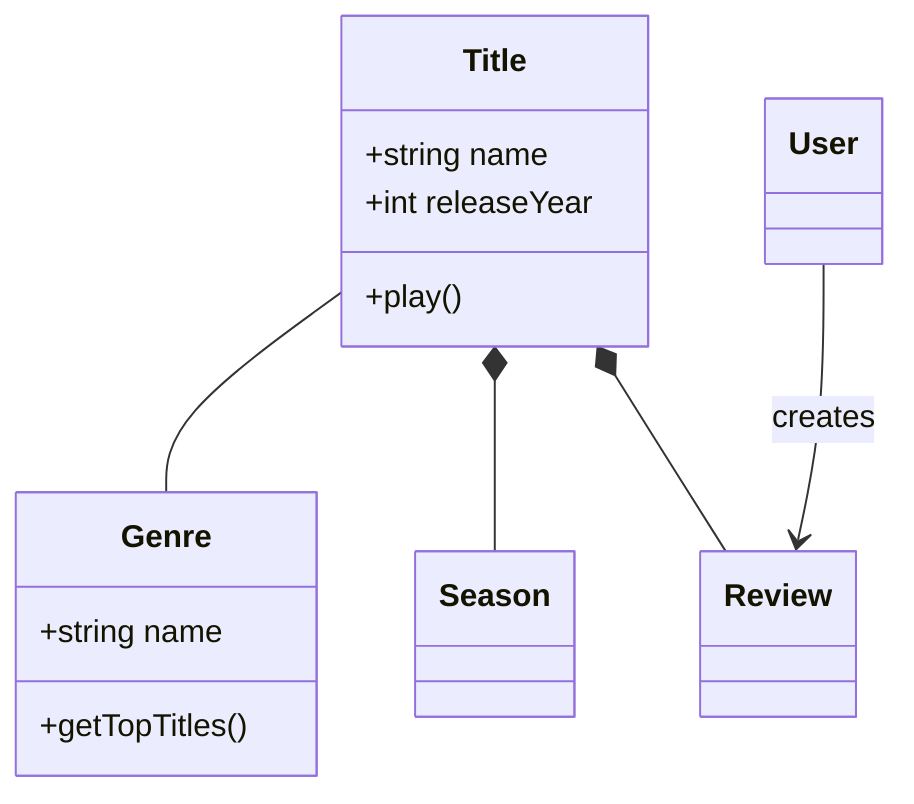
```mermaid
classDiagram
    Title -- Genre
    Title *-- Season
    Title *-- Review
    User --> Review : creates
    
    class Title {
        +string name
        +int releaseYear
        +play()
    }
    
    class Genre {
        +string name
        +getTopTitles()
    }
```

### Sequence Diagram (API Flow)
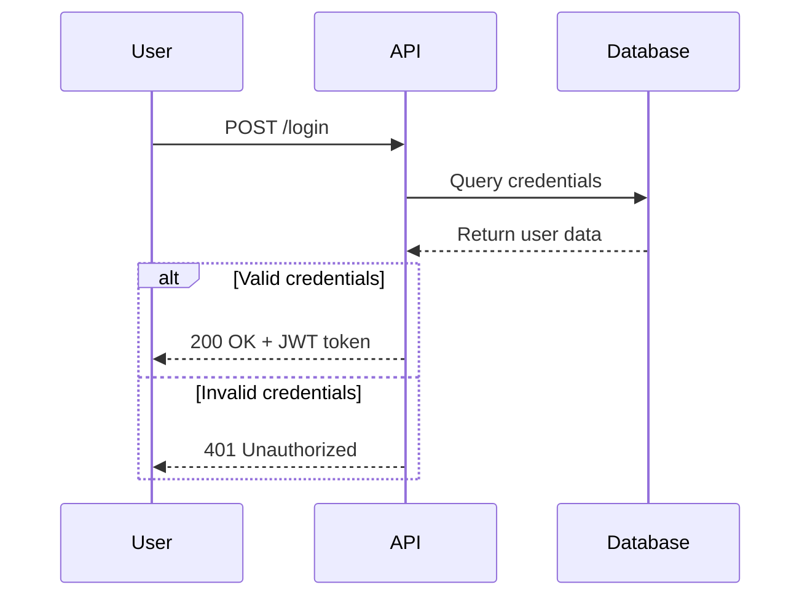
```mermaid
sequenceDiagram
    participant User
    participant API
    participant Database
    
    User->>API: POST /login
    API->>Database: Query credentials
    Database-->>API: Return user data
    alt Valid credentials
        API-->>User: 200 OK + JWT token
    else Invalid credentials
        API-->>User: 401 Unauthorized
    end
```

### Flowchart (User Journey)
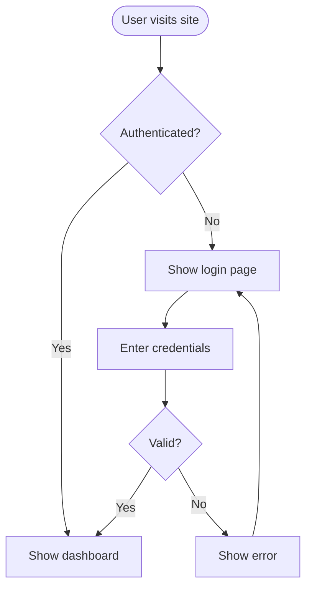
```mermaid
flowchart TD
    Start([User visits site]) --> Auth{Authenticated?}
    Auth -->|No| Login[Show login page]
    Auth -->|Yes| Dashboard[Show dashboard]
    Login --> Creds[Enter credentials]
    Creds --> Validate{Valid?}
    Validate -->|Yes| Dashboard
    Validate -->|No| Error[Show error]
    Error --> Login
```

### ERD (Database Schema)
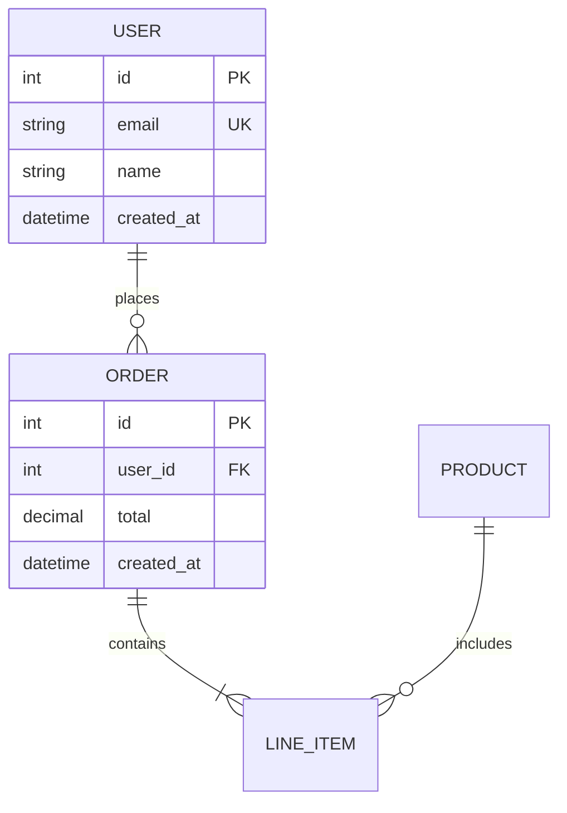
```mermaid
erDiagram
    USER ||--o{ ORDER : places
    ORDER ||--|{ LINE_ITEM : contains
    PRODUCT ||--o{ LINE_ITEM : includes
    
    USER {
        int id PK
        string email UK
        string name
        datetime created_at
    }
    
    ORDER {
        int id PK
        int user_id FK
        decimal total
        datetime created_at
    }
```

## Detailed References

For in-depth guidance on specific diagram types, see:

- **[references/class-diagrams.md](references/class-diagrams.md)** - Domain modeling, relationships (association, composition, aggregation, inheritance), multiplicity, methods/properties
- **[references/sequence-diagrams.md](references/sequence-diagrams.md)** - Actors, participants, messages (sync/async), activations, loops, alt/opt/par blocks, notes
- **[references/flowcharts.md](references/flowcharts.md)** - Node shapes, connections, decision logic, subgraphs, styling
- **[references/erd-diagrams.md](references/erd-diagrams.md)** - Entities, relationships, cardinality, keys, attributes
- **[references/c4-diagrams.md](references/c4-diagrams.md)** - System context, container, component diagrams, boundaries
- **[references/advanced-features.md](references/advanced-features.md)** - Themes, styling, configuration, layout options

## Best Practices

1. **Start Simple** - Begin with core entities/components, add details incrementally
2. **Use Meaningful Names** - Clear labels make diagrams self-documenting
3. **Comment Extensively** - Use `%%` comments to explain complex relationships
4. **Keep Focused** - One diagram per concept; split large diagrams into multiple focused views
5. **Version Control** - Store `.mmd` files alongside code for easy updates
6. **Add Context** - Include titles and notes to explain diagram purpose
7. **Iterate** - Refine diagrams as understanding evolves

## Configuration and Theming

Configure diagrams using frontmatter:

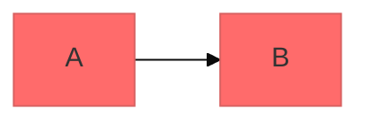
```mermaid
---
config:
  theme: base
  themeVariables:
    primaryColor: "#ff6b6b"
---
flowchart LR
    A --> B
```

**Available themes:** default, forest, dark, neutral, base

**Layout options:**
- `layout: dagre` (default) - Classic balanced layout
- `layout: elk` - Advanced layout for complex diagrams (requires integration)

**Look options:**
- `look: classic` - Traditional Mermaid style
- `look: handDrawn` - Sketch-like appearance

## Exporting and Rendering

**Native support in:**
- GitHub/GitLab - Automatically renders in Markdown
- VS Code - With Markdown Mermaid extension
- Notion, Obsidian, Confluence - Built-in support

**Export options:**
- [Mermaid Live Editor](https://mermaid.live) - Online editor with PNG/SVG export
- Mermaid CLI - `npm install -g @mermaid-js/mermaid-cli` then `mmdc -i input.mmd -o output.png`
- Docker - `docker run --rm -v $(pwd):/data minlag/mermaid-cli -i /data/input.mmd -o /data/output.png`

## Common Pitfalls

- **Breaking characters** - Avoid `{}` in comments, use proper escape sequences for special characters
- **Syntax errors** - Misspellings break diagrams; validate syntax in Mermaid Live
- **Overcomplexity** - Split complex diagrams into multiple focused views
- **Missing relationships** - Document all important connections between entities

## When to Create Diagrams

**Always diagram when:**
- Starting new projects or features
- Documenting complex systems
- Explaining architecture decisions
- Designing database schemas
- Planning refactoring efforts
- Onboarding new team members

**Use diagrams to:**
- Align stakeholders on technical decisions
- Document domain models collaboratively
- Visualize data flows and system interactions
- Plan before coding
- Create living documentation that evolves with code


---


## 📚 Reference Materials


### C4 Diagrams

# C4 Model Diagrams

The C4 model provides a hierarchical way to visualize software architecture at different levels of abstraction: Context, Containers, Components, and Code.

## C4 Model Levels

1. **System Context** - Shows the system and its users/external systems
2. **Container** - Shows applications, databases, and services within the system
3. **Component** - Shows internal structure of containers
4. **Code** - Class diagrams showing implementation details (use regular class diagrams)

## C4 Context Diagram

Shows the big picture: your system and its relationships with users and external systems.

### Basic Syntax

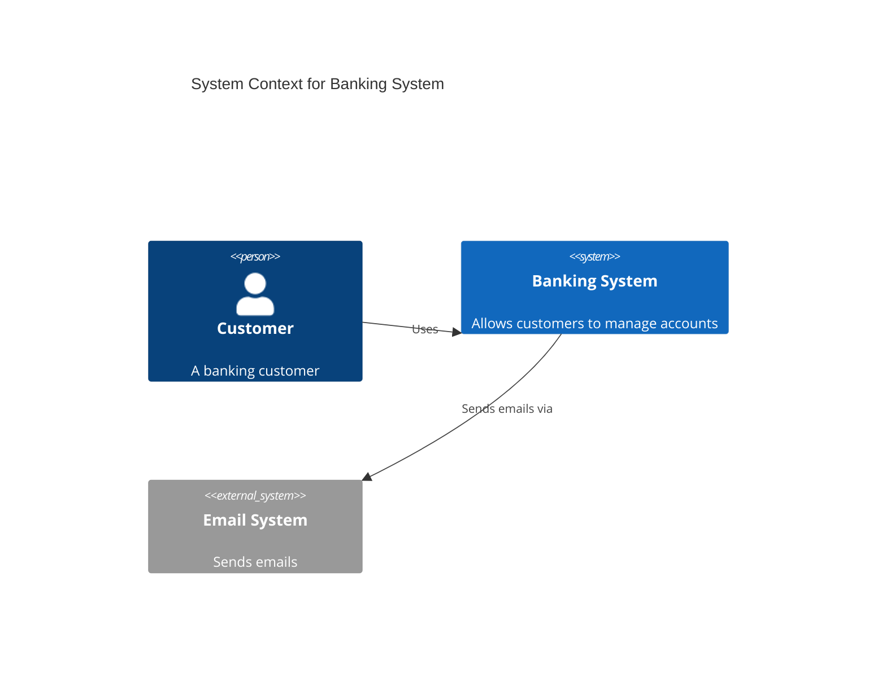
```mermaid
C4Context
    title System Context for Banking System
    
    Person(customer, "Customer", "A banking customer")
    System(banking, "Banking System", "Allows customers to manage accounts")
    System_Ext(email, "Email System", "Sends emails")
    
    Rel(customer, banking, "Uses")
    Rel(banking, email, "Sends emails via")
```

### Elements

**People:**
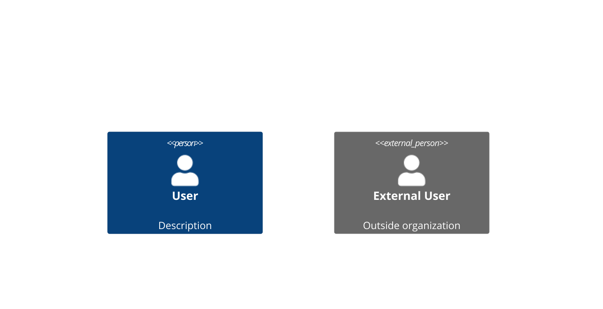
```mermaid
C4Context
    Person(user, "User", "Description")
    Person_Ext(external, "External User", "Outside organization")
```

**Systems:**
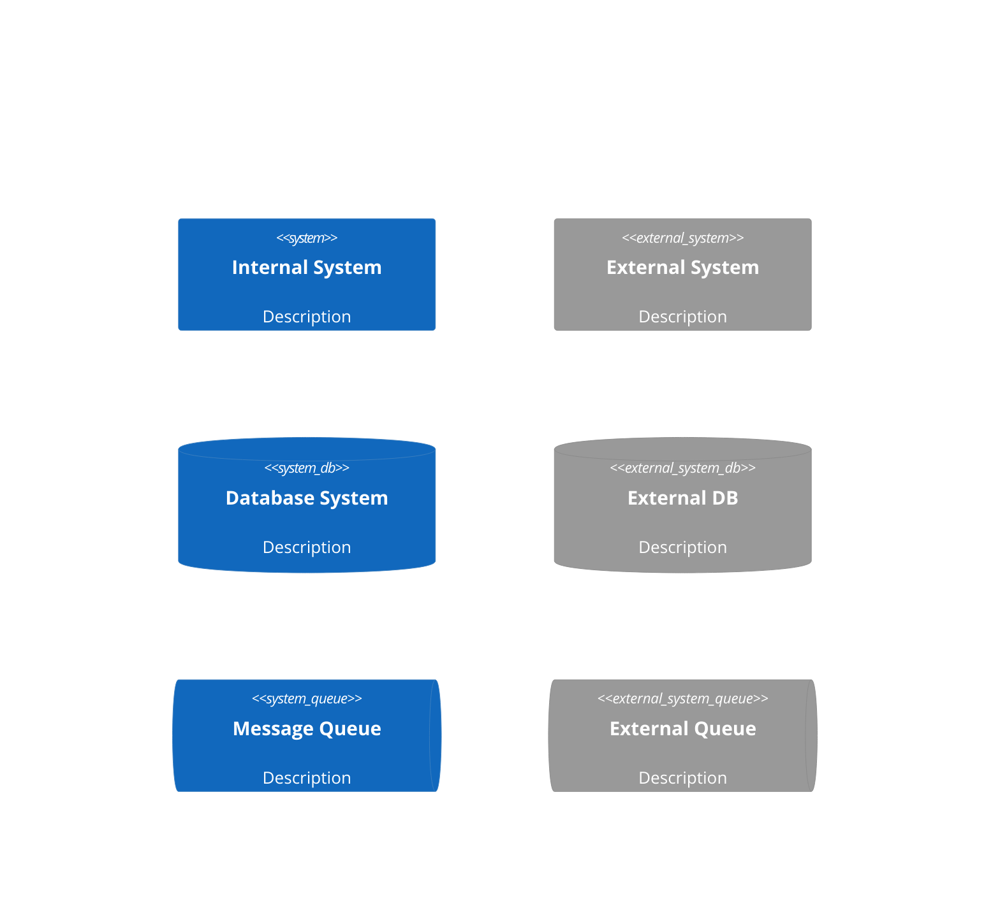
```mermaid
C4Context
    System(internal, "Internal System", "Description")
    System_Ext(external, "External System", "Description")
    SystemDb(database, "Database System", "Description")
    SystemDb_Ext(external_db, "External DB", "Description")
    SystemQueue(queue, "Message Queue", "Description")
    SystemQueue_Ext(external_queue, "External Queue", "Description")
```

**Relationships:**
```mermaid
C4Context
    Rel(from, to, "Label")
    Rel(from, to, "Label", "Optional Technology")
    BiRel(system1, system2, "Bidirectional")
```

### Comprehensive Context Example

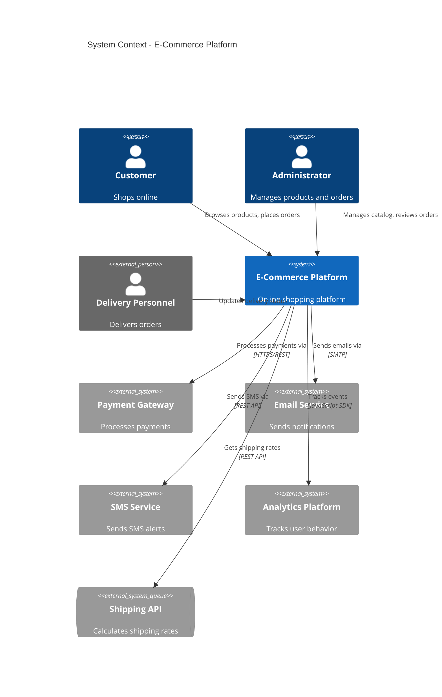
```mermaid
C4Context
    title System Context - E-Commerce Platform
    
    Person(customer, "Customer", "Shops online")
    Person(admin, "Administrator", "Manages products and orders")
    Person_Ext(delivery, "Delivery Personnel", "Delivers orders")
    
    System(ecommerce, "E-Commerce Platform", "Online shopping platform")
    
    System_Ext(payment, "Payment Gateway", "Processes payments")
    System_Ext(email, "Email Service", "Sends notifications")
    System_Ext(sms, "SMS Service", "Sends SMS alerts")
    System_Ext(analytics, "Analytics Platform", "Tracks user behavior")
    SystemQueue_Ext(shipping, "Shipping API", "Calculates shipping rates")
    
    Rel(customer, ecommerce, "Browses products, places orders")
    Rel(admin, ecommerce, "Manages catalog, reviews orders")
    Rel(delivery, ecommerce, "Updates delivery status")
    
    Rel(ecommerce, payment, "Processes payments via", "HTTPS/REST")
    Rel(ecommerce, email, "Sends emails via", "SMTP")
    Rel(ecommerce, sms, "Sends SMS via", "REST API")
    Rel(ecommerce, analytics, "Tracks events", "JavaScript SDK")
    Rel(ecommerce, shipping, "Gets shipping rates", "REST API")
    
    UpdateRelStyle(customer, ecommerce, $offsetX="-50", $offsetY="-30")
    UpdateRelStyle(admin, ecommerce, $offsetX="50", $offsetY="-30")
```

## C4 Container Diagram

Zooms into the system to show containers (applications, databases, services).

### Basic Syntax

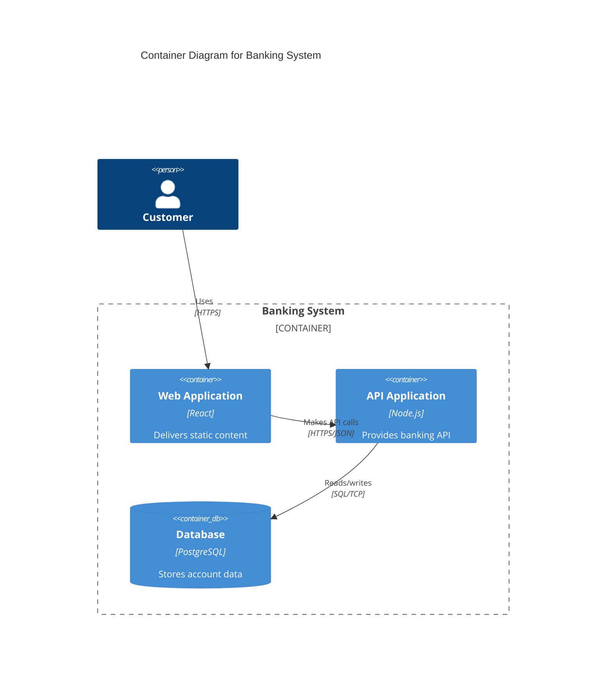
```mermaid
C4Container
    title Container Diagram for Banking System
    
    Person(customer, "Customer")
    
    Container_Boundary(banking, "Banking System") {
        Container(web, "Web Application", "React", "Delivers static content")
        Container(api, "API Application", "Node.js", "Provides banking API")
        ContainerDb(db, "Database", "PostgreSQL", "Stores account data")
    }
    
    Rel(customer, web, "Uses", "HTTPS")
    Rel(web, api, "Makes API calls", "HTTPS/JSON")
    Rel(api, db, "Reads/writes", "SQL/TCP")
```

### Container Elements

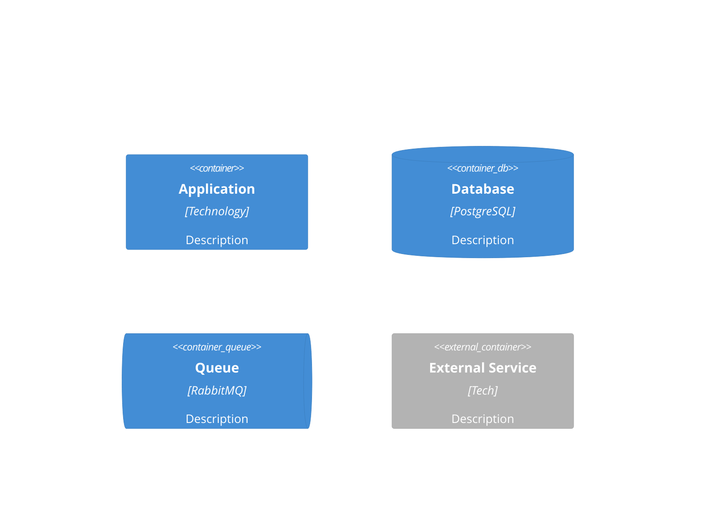
```mermaid
C4Container
    Container(app, "Application", "Technology", "Description")
    ContainerDb(db, "Database", "PostgreSQL", "Description")
    ContainerQueue(queue, "Queue", "RabbitMQ", "Description")
    Container_Ext(external, "External Service", "Tech", "Description")
```

### Container Boundaries

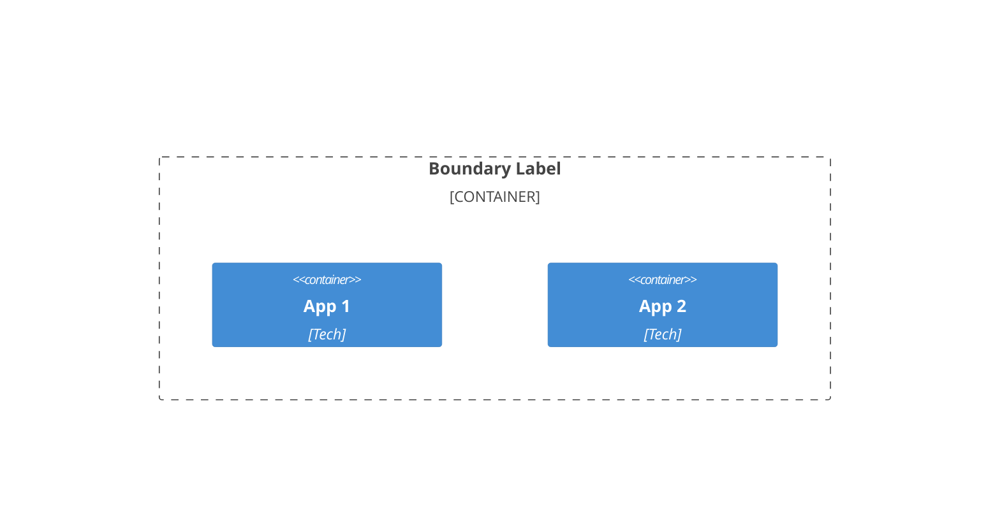
```mermaid
C4Container
    Container_Boundary(boundary_name, "Boundary Label") {
        Container(app1, "App 1", "Tech")
        Container(app2, "App 2", "Tech")
    }
```

### Comprehensive Container Example

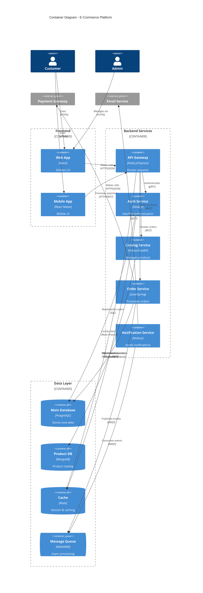
```mermaid
C4Container
    title Container Diagram - E-Commerce Platform
    
    Person(customer, "Customer")
    Person(admin, "Admin")
    System_Ext(payment, "Payment Gateway")
    System_Ext(email, "Email Service")
    
    Container_Boundary(frontend, "Frontend") {
        Container(web, "Web App", "React", "Delivers UI")
        Container(mobile, "Mobile App", "React Native", "Mobile UI")
    }
    
    Container_Boundary(backend, "Backend Services") {
        Container(api, "API Gateway", "Node.js/Express", "Routes requests")
        Container(auth, "Auth Service", "Node.js", "Handles authentication")
        Container(catalog, "Catalog Service", "Python/FastAPI", "Manages products")
        Container(order, "Order Service", "Java/Spring", "Processes orders")
        Container(notification, "Notification Service", "Node.js", "Sends notifications")
    }
    
    Container_Boundary(data, "Data Layer") {
        ContainerDb(postgres, "Main Database", "PostgreSQL", "Stores core data")
        ContainerDb(mongo, "Product DB", "MongoDB", "Product catalog")
        ContainerDb(redis, "Cache", "Redis", "Session & caching")
        ContainerQueue(queue, "Message Queue", "RabbitMQ", "Async processing")
    }
    
    Rel(customer, web, "Uses", "HTTPS")
    Rel(customer, mobile, "Uses", "HTTPS")
    Rel(admin, web, "Manages via", "HTTPS")
    
    Rel(web, api, "Makes calls", "HTTPS/JSON")
    Rel(mobile, api, "Makes calls", "HTTPS/JSON")
    
    Rel(api, auth, "Authenticates", "gRPC")
    Rel(api, catalog, "Gets products", "REST")
    Rel(api, order, "Creates orders", "REST")
    
    Rel(auth, postgres, "Reads/writes users", "SQL")
    Rel(catalog, mongo, "Reads/writes products", "MongoDB Protocol")
    Rel(order, postgres, "Reads/writes orders", "SQL")
    
    Rel(auth, redis, "Stores sessions", "Redis Protocol")
    Rel(api, redis, "Caches data", "Redis Protocol")
    
    Rel(order, queue, "Publishes events", "AMQP")
    Rel(notification, queue, "Consumes events", "AMQP")
    Rel(notification, email, "Sends via", "SMTP")
    Rel(order, payment, "Processes payment", "HTTPS/REST")
```

## C4 Component Diagram

Zooms into a container to show its internal components.

### Basic Syntax

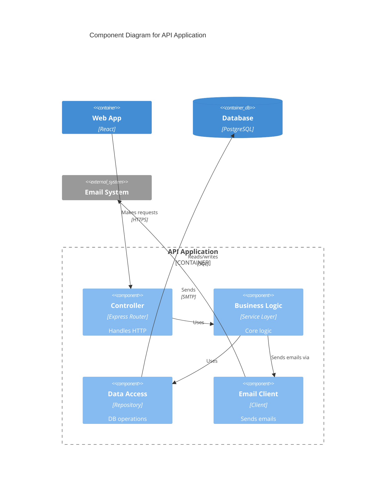
```mermaid
C4Component
    title Component Diagram for API Application
    
    Container(web, "Web App", "React")
    ContainerDb(db, "Database", "PostgreSQL")
    System_Ext(email, "Email System")
    
    Container_Boundary(api, "API Application") {
        Component(controller, "Controller", "Express Router", "Handles HTTP")
        Component(service, "Business Logic", "Service Layer", "Core logic")
        Component(repository, "Data Access", "Repository", "DB operations")
        Component(emailClient, "Email Client", "Client", "Sends emails")
    }
    
    Rel(web, controller, "Makes requests", "HTTPS")
    Rel(controller, service, "Uses")
    Rel(service, repository, "Uses")
    Rel(repository, db, "Reads/writes", "SQL")
    Rel(service, emailClient, "Sends emails via")
    Rel(emailClient, email, "Sends", "SMTP")
```

### Comprehensive Component Example

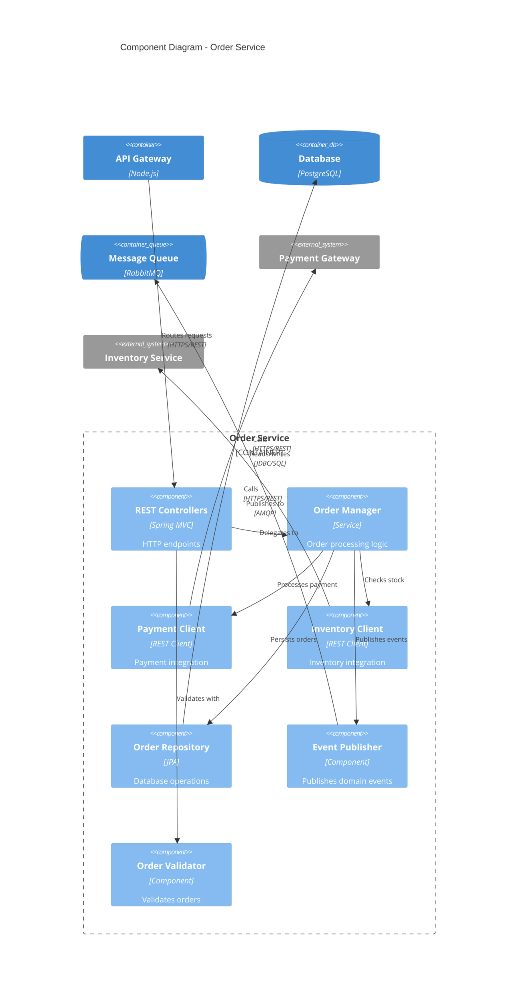
```mermaid
C4Component
    title Component Diagram - Order Service
    
    Container(api_gateway, "API Gateway", "Node.js")
    ContainerDb(postgres, "Database", "PostgreSQL")
    ContainerQueue(queue, "Message Queue", "RabbitMQ")
    System_Ext(payment, "Payment Gateway")
    System_Ext(inventory, "Inventory Service")
    
    Container_Boundary(order_service, "Order Service") {
        Component(controller, "REST Controllers", "Spring MVC", "HTTP endpoints")
        Component(order_logic, "Order Manager", "Service", "Order processing logic")
        Component(payment_client, "Payment Client", "REST Client", "Payment integration")
        Component(inventory_client, "Inventory Client", "REST Client", "Inventory integration")
        Component(repository, "Order Repository", "JPA", "Database operations")
        Component(event_publisher, "Event Publisher", "Component", "Publishes domain events")
        Component(validator, "Order Validator", "Component", "Validates orders")
    }
    
    Rel(api_gateway, controller, "Routes requests", "HTTPS/REST")
    
    Rel(controller, order_logic, "Delegates to")
    Rel(controller, validator, "Validates with")
    
    Rel(order_logic, payment_client, "Processes payment")
    Rel(order_logic, inventory_client, "Checks stock")
    Rel(order_logic, repository, "Persists orders")
    Rel(order_logic, event_publisher, "Publishes events")
    
    Rel(payment_client, payment, "Calls", "HTTPS/REST")
    Rel(inventory_client, inventory, "Calls", "HTTPS/REST")
    Rel(repository, postgres, "Reads/writes", "JDBC/SQL")
    Rel(event_publisher, queue, "Publishes to", "AMQP")
```

## Microservices Architecture Example

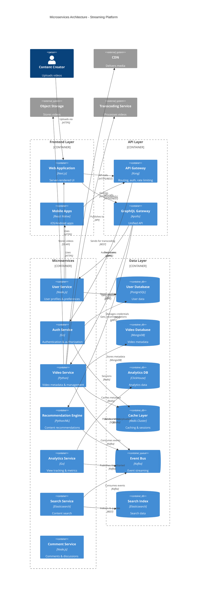
```mermaid
C4Container
    title Microservices Architecture - Streaming Platform
    
    Person(user, "User", "Platform user")
    Person(creator, "Content Creator", "Uploads videos")
    System_Ext(cdn, "CDN", "Delivers media")
    System_Ext(storage, "Object Storage", "Stores videos")
    System_Ext(transcoding, "Transcoding Service", "Processes videos")
    
    Container_Boundary(frontend, "Frontend Layer") {
        Container(web, "Web Application", "Next.js", "Server-rendered UI")
        Container(mobile, "Mobile Apps", "React Native", "iOS/Android apps")
    }
    
    Container_Boundary(api_layer, "API Layer") {
        Container(api_gateway, "API Gateway", "Kong", "Routing, auth, rate limiting")
        Container(graphql, "GraphQL Gateway", "Apollo", "Unified API")
    }
    
    Container_Boundary(services, "Microservices") {
        Container(auth, "Auth Service", "Go", "Authentication & authorization")
        Container(user, "User Service", "Node.js", "User profiles & preferences")
        Container(video, "Video Service", "Python", "Video metadata & management")
        Container(recommendation, "Recommendation Engine", "Python/ML", "Content recommendations")
        Container(analytics, "Analytics Service", "Go", "View tracking & metrics")
        Container(search, "Search Service", "Elasticsearch", "Content search")
        Container(comment, "Comment Service", "Node.js", "Comments & discussions")
    }
    
    Container_Boundary(data, "Data Layer") {
        ContainerDb(user_db, "User Database", "PostgreSQL", "User data")
        ContainerDb(video_db, "Video Database", "MongoDB", "Video metadata")
        ContainerDb(analytics_db, "Analytics DB", "ClickHouse", "Analytics data")
        ContainerDb(cache, "Cache Layer", "Redis Cluster", "Caching & sessions")
        ContainerQueue(event_bus, "Event Bus", "Kafka", "Event streaming")
        ContainerDb(search_index, "Search Index", "Elasticsearch", "Search data")
    }
    
    Rel(user, web, "Uses", "HTTPS")
    Rel(creator, web, "Uploads via", "HTTPS")
    Rel(user, mobile, "Uses", "HTTPS")
    
    Rel(web, api_gateway, "API calls", "HTTPS/REST")
    Rel(mobile, api_gateway, "API calls", "HTTPS/REST")
    Rel(web, graphql, "Queries", "HTTPS/GraphQL")
    
    Rel(api_gateway, auth, "Authenticates", "gRPC")
    Rel(graphql, video, "Gets videos", "gRPC")
    Rel(graphql, user, "Gets users", "gRPC")
    Rel(graphql, recommendation, "Gets recommendations", "gRPC")
    
    Rel(video, storage, "Stores videos", "S3 API")
    Rel(video, transcoding, "Sends for transcoding", "REST")
    Rel(video, cdn, "Publishes to", "API")
    
    Rel(auth, user_db, "Manages credentials", "SQL")
    Rel(user, user_db, "Stores profiles", "SQL")
    Rel(video, video_db, "Stores metadata", "MongoDB")
    Rel(analytics, analytics_db, "Stores metrics", "SQL")
    
    Rel(auth, cache, "Sessions", "Redis")
    Rel(video, cache, "Caches metadata", "Redis")
    Rel(search, search_index, "Indexes & queries", "REST")
    
    Rel(video, event_bus, "Publishes VideoUploaded", "Kafka")
    Rel(analytics, event_bus, "Publishes ViewStarted", "Kafka")
    Rel(recommendation, event_bus, "Consumes events", "Kafka")
    Rel(search, event_bus, "Consumes events", "Kafka")
```

## Best Practices

1. **Use appropriate level** - Context for stakeholders, Container for architects, Component for developers
2. **Keep it focused** - One system per Context diagram, one container per Component diagram
3. **Show key relationships** - Don't clutter with every possible connection
4. **Use consistent naming** - Same names across all diagram levels
5. **Add technology details** - Specify frameworks, languages, protocols at Container/Component level
6. **Update regularly** - Keep diagrams in sync with architecture
7. **Use boundaries** - Group related containers/components logically
8. **Document protocols** - Show communication methods (REST, gRPC, messaging)
9. **Highlight external systems** - Use *_Ext variants for clarity
10. **Start simple** - Begin with Context, drill down as needed

## Common Architecture Patterns

### Monolithic Application
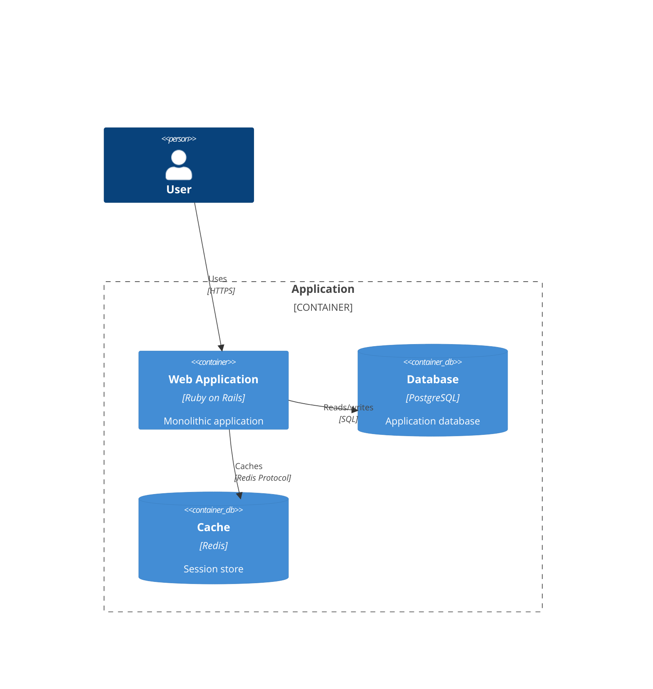
```mermaid
C4Container
    Person(user, "User")
    
    Container_Boundary(system, "Application") {
        Container(app, "Web Application", "Ruby on Rails", "Monolithic application")
        ContainerDb(db, "Database", "PostgreSQL", "Application database")
        ContainerDb(cache, "Cache", "Redis", "Session store")
    }
    
    Rel(user, app, "Uses", "HTTPS")
    Rel(app, db, "Reads/writes", "SQL")
    Rel(app, cache, "Caches", "Redis Protocol")
```

### Three-Tier Architecture
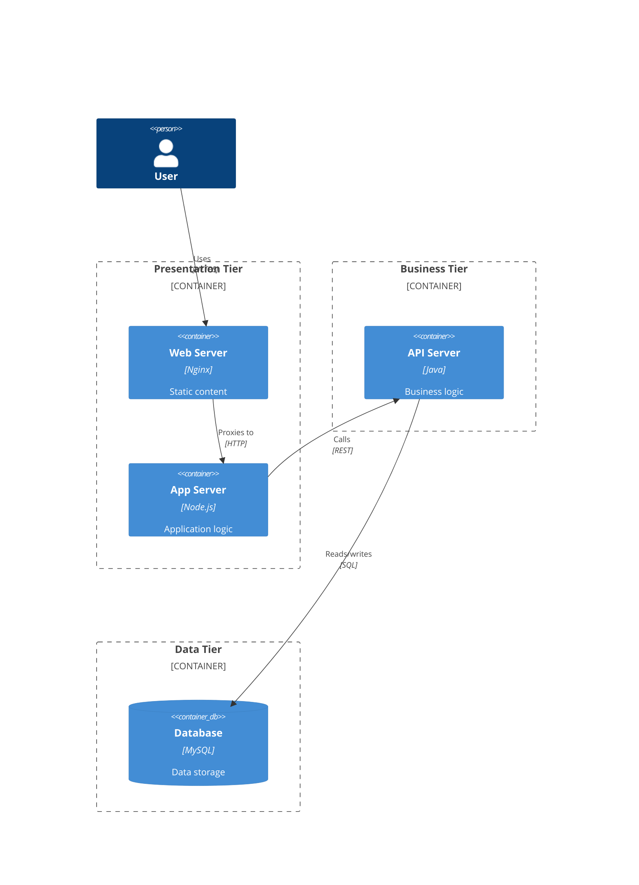
```mermaid
C4Container
    Person(user, "User")
    
    Container_Boundary(presentation, "Presentation Tier") {
        Container(web, "Web Server", "Nginx", "Static content")
        Container(app, "App Server", "Node.js", "Application logic")
    }
    
    Container_Boundary(business, "Business Tier") {
        Container(api, "API Server", "Java", "Business logic")
    }
    
    Container_Boundary(data, "Data Tier") {
        ContainerDb(db, "Database", "MySQL", "Data storage")
    }
    
    Rel(user, web, "Uses", "HTTPS")
    Rel(web, app, "Proxies to", "HTTP")
    Rel(app, api, "Calls", "REST")
    Rel(api, db, "Reads/writes", "SQL")
```

### Event-Driven Architecture
```mermaid
C4Container
    Person(user, "User")
    
    Container(frontend, "Frontend", "React", "User interface")
    Container(api, "API Gateway", "Kong", "API routing")
    
    Container_Boundary(services, "Services") {
        Container(order, "Order Service", "Java", "Order processing")
        Container(inventory, "Inventory Service", "Go", "Stock management")
        Container(notification, "Notification Service", "Node.js", "Alerts")
    }
    
    ContainerQueue(events, "Event Bus", "Kafka", "Event streaming")
    ContainerDb(db, "Databases", "Various", "Service databases")
    
    Rel(user, frontend, "Uses")
    Rel(frontend, api, "Calls")
    Rel(api, order, "Routes to")
    
    Rel(order, events, "Publishes OrderCreated")
    Rel(events, inventory, "Consumes events")
    Rel(events, notification, "Consumes events")
    
    Rel(order, db, "Persists")
    Rel(inventory, db, "Persists")
```


### Sequence Diagrams

# Sequence Diagrams

Sequence diagrams show interactions between participants over time. They're ideal for API flows, authentication sequences, and system component interactions.

## Basic Syntax

```mermaid
sequenceDiagram
    participant A
    participant B
    A->>B: Message
```

## Participants and Actors

```mermaid
sequenceDiagram
    actor User
    participant Frontend
    participant API
    participant Database
    
    User->>Frontend: Click button
    Frontend->>API: POST /data
```

**Difference:**
- `participant` - System components (services, classes, databases)
- `actor` - External entities (users, external systems)

## Message Types

### Solid Arrow (Synchronous)
```mermaid
sequenceDiagram
    Client->>Server: Request
    Server-->>Client: Response
```

- `->>`  Solid arrow (request)
- `-->>`  Dotted arrow (response/return)

### Open Arrow (Asynchronous)
```mermaid
sequenceDiagram
    Client-)Server: Async message
    Server--)Client: Async response
```

- `-)` Solid open arrow
- `--)` Dotted open arrow

### Cross/X (Delete)
```mermaid
sequenceDiagram
    Client-xServer: Delete
```

## Activations

Show when a participant is actively processing:

```mermaid
sequenceDiagram
    Client->>+Server: Request
    Server->>+Database: Query
    Database-->>-Server: Data
    Server-->>-Client: Response
```

- `+` after arrow activates
- `-` before arrow deactivates

## Alt/Else (Conditional Logic)

```mermaid
sequenceDiagram
    User->>API: POST /login
    API->>Database: Query user
    Database-->>API: User data
    
    alt Valid credentials
        API-->>User: 200 OK + Token
    else Invalid credentials
        API-->>User: 401 Unauthorized
    else Account locked
        API-->>User: 403 Forbidden
    end
```

## Opt (Optional)

```mermaid
sequenceDiagram
    User->>API: POST /order
    API->>PaymentService: Process payment
    
    opt Payment successful
        API->>EmailService: Send confirmation
    end
    
    API-->>User: Order result
```

## Par (Parallel)

Show concurrent operations:

```mermaid
sequenceDiagram
    API->>Service: Process order
    
    par Send email
        Service->>EmailService: Send confirmation
    and Update inventory
        Service->>InventoryService: Reduce stock
    and Log event
        Service->>LogService: Log order
    end
    
    Service-->>API: Complete
```

## Loop

```mermaid
sequenceDiagram
    Client->>Server: Request batch
    
    loop For each item
        Server->>Database: Process item
        Database-->>Server: Result
    end
    
    Server-->>Client: All results
```

**Loop with condition:**
```mermaid
sequenceDiagram
    loop Every 5 seconds
        Monitor->>API: Health check
        API-->>Monitor: Status
    end
```

## Break (Early Exit)

```mermaid
sequenceDiagram
    User->>API: Submit form
    API->>Validator: Validate input
    
    break Input invalid
        API-->>User: 400 Bad Request
    end
    
    API->>Database: Save data
    Database-->>API: Success
    API-->>User: 200 OK
```

## Notes

### Note over single participant
```mermaid
sequenceDiagram
    User->>API: Request
    Note over API: Validates JWT token
    API-->>User: Response
```

### Note spanning participants
```mermaid
sequenceDiagram
    Frontend->>API: Request
    Note over Frontend,API: HTTPS encrypted
    API-->>Frontend: Response
```

### Right/Left notes
```mermaid
sequenceDiagram
    User->>System: Action
    Note right of System: Logs to database
    System-->>User: Response
    Note left of User: Updates UI
```

## Sequence Numbers

Automatically number messages:

```mermaid
sequenceDiagram
    autonumber
    
    User->>Frontend: Login
    Frontend->>API: Authenticate
    API->>Database: Verify credentials
    Database-->>API: User data
    API-->>Frontend: JWT token
    Frontend-->>User: Success
```

## Links and Tooltips

Add clickable links:

```mermaid
sequenceDiagram
    participant A as Service A
    link A: Dashboard @ https://dashboard.example.com
    link A: API Docs @ https://docs.example.com
    
    A->>B: Message
```

## Comprehensive Example: User Authentication Flow

```mermaid
sequenceDiagram
    autonumber
    actor User
    participant Frontend
    participant AuthAPI
    participant Database
    participant Redis
    participant EmailService
    
    User->>+Frontend: Enter credentials
    Frontend->>+AuthAPI: POST /auth/login
    
    AuthAPI->>+Database: Query user by email
    Database-->>-AuthAPI: User record
    
    alt User not found
        AuthAPI-->>Frontend: 404 User not found
        Frontend-->>User: Show error
    else User found
        AuthAPI->>AuthAPI: Verify password hash
        
        alt Invalid password
            AuthAPI->>Database: Increment failed attempts
            
            opt Failed attempts > 5
                AuthAPI->>Database: Lock account
                AuthAPI->>EmailService: Send security alert
            end
            
            AuthAPI-->>Frontend: 401 Invalid credentials
            Frontend-->>User: Show error
        else Valid password
            AuthAPI->>AuthAPI: Generate JWT token
            AuthAPI->>+Redis: Store session
            Redis-->>-AuthAPI: Confirm
            
            par Update login metadata
                AuthAPI->>Database: Update last_login
            and Track analytics
                AuthAPI->>Database: Log login event
            end
            
            AuthAPI-->>-Frontend: 200 OK + JWT token
            Frontend->>Frontend: Store token in localStorage
            Frontend-->>-User: Redirect to dashboard
            
            opt First login
                EmailService->>User: Welcome email
            end
        end
    end
```

## API Request/Response Example

```mermaid
sequenceDiagram
    autonumber
    participant Client
    participant Gateway
    participant AuthService
    participant UserService
    participant Database
    
    Client->>+Gateway: GET /api/users/123
    Note over Gateway: Rate limiting check
    
    Gateway->>+AuthService: Validate JWT
    AuthService->>AuthService: Verify signature
    
    alt Token invalid or expired
        AuthService-->>Gateway: 401 Unauthorized
        Gateway-->>Client: 401 Unauthorized
    else Token valid
        AuthService-->>-Gateway: User context
        
        Gateway->>+UserService: GET /users/123
        UserService->>+Database: SELECT * FROM users WHERE id=123
        Database-->>-UserService: User record
        
        alt User not found
            UserService-->>Gateway: 404 Not Found
            Gateway-->>Client: 404 Not Found
        else User found
            UserService-->>-Gateway: 200 OK + User data
            Gateway-->>-Client: 200 OK + User data
        end
    end
```

## Microservices Communication

```mermaid
sequenceDiagram
    actor User
    participant Gateway
    participant OrderService
    participant PaymentService
    participant InventoryService
    participant NotificationService
    participant MessageQueue
    
    User->>+Gateway: POST /orders
    Gateway->>+OrderService: Create order
    
    OrderService->>+InventoryService: Check stock
    InventoryService-->>-OrderService: Stock available
    
    break Insufficient stock
        OrderService-->>Gateway: 400 Out of stock
        Gateway-->>User: Error message
    end
    
    OrderService->>OrderService: Reserve order
    OrderService->>+PaymentService: Charge customer
    
    alt Payment successful
        PaymentService-->>-OrderService: Payment confirmed
        OrderService->>MessageQueue: Publish OrderConfirmed event
        
        par Async processing
            MessageQueue->>InventoryService: Reduce stock
        and
            MessageQueue->>NotificationService: Send confirmation
            NotificationService->>User: Email confirmation
        end
        
        OrderService-->>-Gateway: 201 Created
        Gateway-->>User: Order confirmed
    else Payment failed
        PaymentService-->>OrderService: Payment declined
        OrderService->>OrderService: Release reservation
        OrderService-->>Gateway: 402 Payment Required
        Gateway-->>User: Payment failed
    end
```

## Best Practices

1. **Order participants logically** - Typically: User → Frontend → Backend → Database
2. **Use activations** - Shows when components are actively processing
3. **Group related logic** - Use alt/opt/par to organize conditional flows
4. **Add descriptive notes** - Explain complex logic or important details
5. **Keep diagrams focused** - One scenario per diagram
6. **Number messages** - Use autonumber for complex flows
7. **Show error paths** - Document failure scenarios with alt/else
8. **Indicate async operations** - Use open arrows for fire-and-forget messages

## Common Use Cases

### Authentication
- Login flows
- OAuth/SSO flows
- Token refresh
- Password reset

### API Operations
- CRUD operations
- Search and filtering
- Batch processing
- Webhook handling

### System Integration
- Microservice communication
- Third-party API calls
- Message queue processing
- Event-driven architecture

### Business Processes
- Order fulfillment
- Payment processing
- Approval workflows
- Notification chains


### Advanced Features

# Advanced Mermaid Features

Advanced configuration, styling, theming, and other powerful features for creating professional diagrams.

## Frontmatter Configuration

Add YAML configuration at the top of diagrams:

```mermaid
---
config:
  theme: dark
  themeVariables:
    primaryColor: "#ff6b6b"
    primaryTextColor: "#fff"
    primaryBorderColor: "#333"
    lineColor: "#666"
    secondaryColor: "#4ecdc4"
    tertiaryColor: "#ffe66d"
---
flowchart TD
    A --> B
```

## Themes

### Built-in Themes

```mermaid
---
config:
  theme: default
---
```

**Available themes:**
- `default` - Standard blue theme
- `forest` - Green earth tones
- `dark` - Dark mode friendly
- `neutral` - Grayscale professional
- `base` - Minimal base theme for customization

### Theme Examples

**Default Theme:**
```mermaid
---
config:
  theme: default
---
flowchart LR
    A[Start] --> B[Process]
    B --> C{Decision}
    C -->|Yes| D[Action 1]
    C -->|No| E[Action 2]
```

**Dark Theme:**
```mermaid
---
config:
  theme: dark
---
flowchart LR
    A[Start] --> B[Process]
    B --> C{Decision}
```

**Forest Theme:**
```mermaid
---
config:
  theme: forest
---
flowchart LR
    A[Start] --> B[Process]
```

## Custom Theme Variables

Override specific colors:

```mermaid
---
config:
  theme: base
  themeVariables:
    primaryColor: "#ff6b6b"
    primaryTextColor: "#fff"
    primaryBorderColor: "#d63031"
    lineColor: "#74b9ff"
    secondaryColor: "#00b894"
    tertiaryColor: "#fdcb6e"
    background: "#f0f0f0"
    mainBkg: "#ffffff"
    textColor: "#333333"
    nodeBorder: "#333333"
    clusterBkg: "#f9f9f9"
    clusterBorder: "#666666"
---
flowchart TD
    A --> B --> C
```

## Layout Options

### Dagre Layout (Default)

```mermaid
---
config:
  layout: dagre
---
flowchart TD
    A --> B
```

### ELK Layout (Advanced)

For complex diagrams with better automatic layout:

```mermaid
---
config:
  layout: elk
  elk:
    mergeEdges: true
    nodePlacementStrategy: BRANDES_KOEPF
---
flowchart TD
    A --> B
```

**ELK node placement strategies:**
- `SIMPLE` - Basic placement
- `NETWORK_SIMPLEX` - Network optimization
- `LINEAR_SEGMENTS` - Linear arrangement
- `BRANDES_KOEPF` - Balanced (default)

## Look Options

### Classic Look

Traditional Mermaid appearance:

```mermaid
---
config:
  look: classic
---
flowchart LR
    A --> B --> C
```

### Hand-Drawn Look

Sketch-like, informal style:

```mermaid
---
config:
  look: handDrawn
---
flowchart LR
    A --> B --> C
```

## Complete Configuration Example

```mermaid
---
config:
  theme: base
  look: handDrawn
  layout: dagre
  themeVariables:
    primaryColor: "#ff6b6b"
    primaryTextColor: "#fff"
    primaryBorderColor: "#d63031"
    lineColor: "#74b9ff"
    secondaryColor: "#00b894"
    tertiaryColor: "#fdcb6e"
---
flowchart TD
    Start([Begin Process]) --> Input[Gather Data]
    Input --> Process{Valid?}
    Process -->|Yes| Store[(Save to DB)]
    Process -->|No| Error[Show Error]
    Store --> Notify[Send Notification]
    Error --> Input
    Notify --> End([Complete])
```

## Diagram-Specific Styling

### Flowchart Styling

**Class-based styling:**
```mermaid
flowchart TD
    A[Normal]:::success
    B[Warning]:::warning
    C[Error]:::error
    
    classDef success fill:#00b894,stroke:#00a383,color:#fff
    classDef warning fill:#fdcb6e,stroke:#e8b923,color:#333
    classDef error fill:#ff6b6b,stroke:#ee5253,color:#fff
    
    A --> B --> C
```

**Node-specific styling:**
```mermaid
flowchart LR
    A[Node A]
    B[Node B]
    C[Node C]
    
    style A fill:#ff6b6b,stroke:#333,stroke-width:4px
    style B fill:#4ecdc4,stroke:#333,stroke-width:2px
    style C fill:#ffe66d,stroke:#333,stroke-width:2px
    
    A --> B --> C
```

**Link styling:**
```mermaid
flowchart LR
    A --> B
    B --> C
    C --> D
    
    linkStyle 0 stroke:#ff6b6b,stroke-width:4px
    linkStyle 1 stroke:#4ecdc4,stroke-width:2px
    linkStyle 2 stroke:#ffe66d,stroke-width:2px
```

### Sequence Diagram Styling

```mermaid
sequenceDiagram
    participant A
    participant B
    participant C
    
    A->>B: Message 1
    B->>C: Message 2
    
    Note over A,C: Styled note
    
    %%{init: {'theme':'forest'}}%%
```

### Class Diagram Styling

```mermaid
classDiagram
    class User {
        +String name
        +login()
    }
    
    class Admin {
        +manageUsers()
    }
    
    User <|-- Admin
    
    %%{init: {'theme':'dark'}}%%
```

## Directional Hints

Control layout direction for specific nodes:

```mermaid
flowchart TB
    A --> B
    B --> C
    B --> D
    C --> E
    D --> E
    
    %% This is a comment - helps organize complex diagrams
```

## Click Events and Links

Add interactive elements:

```mermaid
flowchart LR
    A[GitHub]
    B[Documentation]
    C[Live Demo]
    
    click A "https://github.com" "Go to GitHub"
    click B "https://mermaid.js.org" "View Docs"
    click C "https://mermaid.live" "Try Live Editor"
    
    A --> B --> C
```

## Tooltips

Add hover information:

```mermaid
flowchart LR
    A[Service A]
    B[Service B]
    
    A -.->|REST API| B
    
    %% Tooltips are defined with links
    link A: API Documentation @ https://api.example.com
    link B: Service Dashboard @ https://dashboard.example.com
```

## Subgraph Styling

```mermaid
flowchart TB
    subgraph Frontend
        A[Web App]
        B[Mobile App]
    end
    
    subgraph Backend
        C[API]
        D[Database]
    end
    
    A & B --> C
    C --> D
    
    style Frontend fill:#e3f2fd,stroke:#2196f3,stroke-width:2px
    style Backend fill:#fff3e0,stroke:#ff9800,stroke-width:2px
```

## Comments and Documentation

```mermaid
flowchart TD
    %% This is a single-line comment
    
    %% Multi-line comments can be created
    %% by using multiple comment lines
    
    A[Start]
    B[Process]
    C[End]
    
    %% Define relationships
    A --> B
    B --> C
    
    %% Add styling
    style A fill:#90EE90
    style C fill:#FFB6C1
```

## Complex Styling Example

```mermaid
flowchart TB
    subgraph production[Production Environment]
        direction LR
        lb[Load Balancer]
        
        subgraph servers[Application Servers]
            app1[Server 1]
            app2[Server 2]
            app3[Server 3]
        end
        
        cache[(Redis Cache)]
        db[(PostgreSQL)]
    end
    
    subgraph monitoring[Monitoring]
        logs[Log Aggregator]
        metrics[Metrics Dashboard]
    end
    
    users[Users] --> lb
    lb --> app1 & app2 & app3
    app1 & app2 & app3 --> cache
    app1 & app2 & app3 --> db
    app1 & app2 & app3 --> logs
    logs --> metrics
    
    style production fill:#e8f5e9,stroke:#4caf50,stroke-width:3px
    style servers fill:#fff3e0,stroke:#ff9800,stroke-width:2px
    style monitoring fill:#e3f2fd,stroke:#2196f3,stroke-width:2px
    
    style lb fill:#ffeb3b,stroke:#fbc02d,stroke-width:2px
    style cache fill:#ce93d8,stroke:#ab47bc,stroke-width:2px
    style db fill:#ce93d8,stroke:#ab47bc,stroke-width:2px
    
    classDef serverClass fill:#81c784,stroke:#4caf50,stroke-width:2px,color:#000
    class app1,app2,app3 serverClass
    
    linkStyle 0,1,2,3 stroke:#4caf50,stroke-width:2px
    linkStyle 4,5,6,7,8,9 stroke:#ff9800,stroke-width:1px
```

## Responsive Sizing

Use CSS to make diagrams responsive:

```html
<div style="max-width: 100%; overflow: auto;">
    <pre class="mermaid">
        flowchart LR
            A --> B --> C
    </pre>
</div>
```

## SVG Export Options

When exporting to SVG:

```bash
# Export with custom dimensions
mmdc -i diagram.mmd -o output.svg -w 1920 -H 1080

# Export with background color
mmdc -i diagram.mmd -o output.svg -b "#ffffff"

# Export with transparent background
mmdc -i diagram.mmd -o output.svg -b "transparent"
```

## Best Practices for Advanced Features

1. **Use themes consistently** - Pick one theme for related diagrams
2. **Don't over-style** - Too many colors can reduce clarity
3. **Test hand-drawn look** - Some diagrams work better with classic look
4. **Use ELK for complex layouts** - When dagre creates crossed lines
5. **Comment complex configurations** - Explain non-obvious styling choices
6. **Keep it accessible** - Ensure sufficient color contrast
7. **Test exports** - Verify diagrams render correctly in target format
8. **Version control configs** - Track theme changes in your repository

## Accessibility Considerations

```mermaid
---
config:
  theme: base
  themeVariables:
    primaryColor: "#0066cc"
    primaryTextColor: "#ffffff"
    primaryBorderColor: "#003d7a"
    lineColor: "#333333"
    background: "#ffffff"
    mainBkg: "#f0f0f0"
---
flowchart TD
    A[High Contrast Text] --> B[Clear Labels]
    B --> C[Meaningful Colors]
```

**Accessibility tips:**
- Use high contrast color combinations
- Don't rely solely on color to convey meaning
- Include descriptive text labels
- Test with color blindness simulators
- Consider dark mode alternatives

## Performance Considerations

For large diagrams:

```mermaid
---
config:
  layout: elk
  elk:
    mergeEdges: true
---
flowchart TD
    %% ELK handles complex layouts better
    %% Merge edges reduces visual clutter
```

**Performance tips:**
- Use ELK layout for diagrams with >20 nodes
- Enable edge merging for simplified connections
- Split very large diagrams into multiple focused views
- Consider using subgraphs to organize complexity
- Limit styling to essential elements

## Integration Examples

### Markdown Files

````markdown
# System Architecture

```mermaid
flowchart LR
    A --> B
```
````

### HTML Files

```html
<!DOCTYPE html>
<html>
<head>
    <script type="module">
        import mermaid from 'https://cdn.jsdelivr.net/npm/mermaid@10/dist/mermaid.esm.min.mjs';
        mermaid.initialize({ 
            startOnLoad: true,
            theme: 'dark',
            look: 'handDrawn'
        });
    </script>
</head>
<body>
    <pre class="mermaid">
        flowchart LR
            A --> B
    </pre>
</body>
</html>
```

### React Components

```jsx
import React from 'react';
import mermaid from 'mermaid';

mermaid.initialize({
    startOnLoad: true,
    theme: 'forest'
});

function DiagramComponent() {
    React.useEffect(() => {
        mermaid.contentLoaded();
    }, []);
    
    return (
        <div className="mermaid">
            flowchart LR
                A --> B
        </div>
    );
}
```


### Erd Diagrams

# Entity Relationship Diagrams (ERD)

ERDs model database schemas, showing tables (entities), their columns (attributes), and relationships between tables. Essential for database design and documentation.

## Basic Syntax

```mermaid
erDiagram
    CUSTOMER ||--o{ ORDER : places
```

## Defining Entities

```mermaid
erDiagram
    CUSTOMER
    ORDER
    PRODUCT
```

## Entity Attributes

Define columns with type and constraints:

```mermaid
erDiagram
    CUSTOMER {
        int id PK
        string email UK
        string name
        string phone
        datetime created_at
    }
```

**Attribute format:** `type name constraints`

**Common constraints:**
- `PK` - Primary Key
- `FK` - Foreign Key
- `UK` - Unique Key
- `NN` - Not Null

## Relationships

### Relationship Symbols

**Cardinality indicators:**
- `||` - Exactly one
- `|o` - Zero or one
- `}{` - One or many
- `}o` - Zero or many

**Relationship line:**
- `--` - Non-identifying relationship
- `..` - Identifying relationship (rare in practice)

### Common Relationships

```mermaid
erDiagram
    %% One-to-One
    USER ||--|| PROFILE : has
    
    %% One-to-Many
    CUSTOMER ||--o{ ORDER : places
    
    %% Many-to-Many (with junction table)
    STUDENT }o--o{ COURSE : enrolls
    STUDENT ||--o{ ENROLLMENT : has
    COURSE ||--o{ ENROLLMENT : includes
    
    %% Optional Relationships
    EMPLOYEE |o--o{ DEPARTMENT : manages
```

### Relationship with Labels

```mermaid
erDiagram
    AUTHOR ||--o{ BOOK : writes
    BOOK }o--|| PUBLISHER : "published by"
    READER }o--o{ BOOK : reads
```

## Data Types

Use standard database types:
- `int`, `bigint`, `smallint`
- `varchar`, `text`, `char`
- `decimal`, `float`, `double`
- `boolean`, `bool`
- `date`, `datetime`, `timestamp`
- `json`, `jsonb`
- `uuid`
- `blob`, `bytea`

## Comprehensive Example: E-Commerce Database

```mermaid
erDiagram
    CUSTOMER ||--o{ ORDER : places
    CUSTOMER ||--o{ REVIEW : writes
    CUSTOMER ||--o{ ADDRESS : has
    ORDER ||--|{ LINE_ITEM : contains
    PRODUCT ||--o{ LINE_ITEM : "ordered in"
    PRODUCT }o--|| CATEGORY : "belongs to"
    PRODUCT ||--o{ REVIEW : receives
    PRODUCT ||--o{ INVENTORY : tracks
    ORDER ||--|| PAYMENT : "paid by"
    ORDER ||--o| SHIPMENT : "shipped via"
    
    CUSTOMER {
        uuid id PK
        varchar email UK "NOT NULL"
        varchar name "NOT NULL"
        varchar phone
        timestamp created_at "DEFAULT NOW()"
        timestamp updated_at
    }
    
    ADDRESS {
        uuid id PK
        uuid customer_id FK
        varchar street "NOT NULL"
        varchar city "NOT NULL"
        varchar state
        varchar postal_code
        varchar country "NOT NULL"
        boolean is_default
    }
    
    ORDER {
        uuid id PK
        uuid customer_id FK "NOT NULL"
        decimal total "NOT NULL"
        varchar status "NOT NULL"
        timestamp order_date "DEFAULT NOW()"
        timestamp shipped_date
        timestamp delivered_date
    }
    
    LINE_ITEM {
        uuid id PK
        uuid order_id FK "NOT NULL"
        uuid product_id FK "NOT NULL"
        int quantity "NOT NULL"
        decimal price_per_unit "NOT NULL"
        decimal subtotal "COMPUTED"
    }
    
    PRODUCT {
        uuid id PK
        varchar sku UK "NOT NULL"
        varchar name "NOT NULL"
        text description
        decimal price "NOT NULL"
        uuid category_id FK
        boolean is_active "DEFAULT TRUE"
        timestamp created_at "DEFAULT NOW()"
    }
    
    CATEGORY {
        uuid id PK
        varchar name UK "NOT NULL"
        text description
        uuid parent_category_id FK
    }
    
    INVENTORY {
        uuid id PK
        uuid product_id FK "NOT NULL"
        int quantity "DEFAULT 0"
        varchar warehouse_location
        timestamp last_updated
    }
    
    REVIEW {
        uuid id PK
        uuid customer_id FK "NOT NULL"
        uuid product_id FK "NOT NULL"
        int rating "CHECK 1-5"
        text comment
        timestamp created_at "DEFAULT NOW()"
    }
    
    PAYMENT {
        uuid id PK
        uuid order_id FK "NOT NULL"
        varchar payment_method "NOT NULL"
        decimal amount "NOT NULL"
        varchar status "NOT NULL"
        varchar transaction_id UK
        timestamp processed_at
    }
    
    SHIPMENT {
        uuid id PK
        uuid order_id FK "NOT NULL"
        varchar carrier
        varchar tracking_number
        timestamp shipped_date
        timestamp estimated_delivery
        timestamp actual_delivery
    }
```

## Blog Platform Schema

```mermaid
erDiagram
    USER ||--o{ POST : creates
    USER ||--o{ COMMENT : writes
    POST ||--o{ COMMENT : receives
    POST }o--o{ TAG : tagged_with
    POST ||--o{ POST_TAG : has
    TAG ||--o{ POST_TAG : applied_to
    POST }o--|| CATEGORY : "belongs to"
    USER ||--o{ LIKE : gives
    POST ||--o{ LIKE : receives
    COMMENT ||--o{ LIKE : receives
    
    USER {
        bigint id PK "AUTO_INCREMENT"
        varchar email UK "NOT NULL"
        varchar username UK "NOT NULL"
        varchar password_hash "NOT NULL"
        varchar display_name
        text bio
        varchar avatar_url
        timestamp created_at "DEFAULT NOW()"
        timestamp last_login
    }
    
    POST {
        bigint id PK "AUTO_INCREMENT"
        bigint user_id FK "NOT NULL"
        bigint category_id FK
        varchar title "NOT NULL"
        varchar slug UK "NOT NULL"
        text content "NOT NULL"
        text excerpt
        varchar featured_image_url
        varchar status "NOT NULL DEFAULT 'draft'"
        int view_count "DEFAULT 0"
        timestamp published_at
        timestamp created_at "DEFAULT NOW()"
        timestamp updated_at
    }
    
    COMMENT {
        bigint id PK "AUTO_INCREMENT"
        bigint user_id FK "NOT NULL"
        bigint post_id FK "NOT NULL"
        bigint parent_comment_id FK "NULL"
        text content "NOT NULL"
        varchar status "DEFAULT 'pending'"
        timestamp created_at "DEFAULT NOW()"
    }
    
    CATEGORY {
        bigint id PK "AUTO_INCREMENT"
        varchar name UK "NOT NULL"
        varchar slug UK "NOT NULL"
        text description
        bigint parent_id FK
    }
    
    TAG {
        bigint id PK "AUTO_INCREMENT"
        varchar name UK "NOT NULL"
        varchar slug UK "NOT NULL"
    }
    
    POST_TAG {
        bigint post_id FK "NOT NULL"
        bigint tag_id FK "NOT NULL"
    }
    
    LIKE {
        bigint id PK "AUTO_INCREMENT"
        bigint user_id FK "NOT NULL"
        varchar likeable_type "NOT NULL"
        bigint likeable_id "NOT NULL"
        timestamp created_at "DEFAULT NOW()"
    }
```

## Social Media Schema

```mermaid
erDiagram
    USER ||--o{ POST : creates
    USER ||--o{ FOLLOW : follows
    USER ||--o{ FOLLOW : "followed by"
    POST ||--o{ LIKE : receives
    POST ||--o{ COMMENT : has
    USER ||--o{ LIKE : gives
    USER ||--o{ COMMENT : makes
    USER ||--o{ NOTIFICATION : receives
    POST ||--o{ POST_MEDIA : contains
    USER }o--o{ GROUP : "member of"
    USER ||--o{ MESSAGE : sends
    USER ||--o{ MESSAGE : receives
    
    USER {
        uuid id PK
        varchar username UK "NOT NULL"
        varchar email UK "NOT NULL"
        varchar password_hash "NOT NULL"
        varchar full_name
        text bio
        varchar profile_picture_url
        varchar cover_photo_url
        boolean is_verified "DEFAULT FALSE"
        boolean is_private "DEFAULT FALSE"
        timestamp created_at "DEFAULT NOW()"
    }
    
    POST {
        uuid id PK
        uuid user_id FK "NOT NULL"
        text content
        varchar visibility "DEFAULT 'public'"
        int likes_count "DEFAULT 0"
        int comments_count "DEFAULT 0"
        int shares_count "DEFAULT 0"
        timestamp created_at "DEFAULT NOW()"
        timestamp edited_at
    }
    
    POST_MEDIA {
        uuid id PK
        uuid post_id FK "NOT NULL"
        varchar media_type "NOT NULL"
        varchar media_url "NOT NULL"
        int display_order
    }
    
    FOLLOW {
        uuid id PK
        uuid follower_id FK "NOT NULL"
        uuid following_id FK "NOT NULL"
        timestamp created_at "DEFAULT NOW()"
    }
    
    LIKE {
        uuid id PK
        uuid user_id FK "NOT NULL"
        uuid post_id FK "NOT NULL"
        timestamp created_at "DEFAULT NOW()"
    }
    
    COMMENT {
        uuid id PK
        uuid user_id FK "NOT NULL"
        uuid post_id FK "NOT NULL"
        uuid parent_comment_id FK
        text content "NOT NULL"
        int likes_count "DEFAULT 0"
        timestamp created_at "DEFAULT NOW()"
    }
    
    MESSAGE {
        uuid id PK
        uuid sender_id FK "NOT NULL"
        uuid receiver_id FK "NOT NULL"
        text content "NOT NULL"
        boolean is_read "DEFAULT FALSE"
        timestamp created_at "DEFAULT NOW()"
        timestamp read_at
    }
    
    NOTIFICATION {
        uuid id PK
        uuid user_id FK "NOT NULL"
        varchar notification_type "NOT NULL"
        text content "NOT NULL"
        boolean is_read "DEFAULT FALSE"
        varchar related_entity_type
        uuid related_entity_id
        timestamp created_at "DEFAULT NOW()"
    }
    
    GROUP {
        uuid id PK
        varchar name "NOT NULL"
        text description
        uuid created_by FK "NOT NULL"
        boolean is_private "DEFAULT FALSE"
        timestamp created_at "DEFAULT NOW()"
    }
```

## Best Practices

1. **Name entities in UPPERCASE** - Convention for clarity
2. **Use singular names** - `USER` not `USERS`, `ORDER` not `ORDERS`
3. **Define all constraints** - Document PKs, FKs, UKs, NOT NULL
4. **Show cardinality accurately** - Be precise about one-to-many vs many-to-many
5. **Include timestamps** - created_at, updated_at for auditing
6. **Document computed columns** - Mark calculated/derived values
7. **Add meaningful comments** - Use quotes for constraints and descriptions
8. **Consider junction tables** - Explicitly model many-to-many relationships
9. **Use appropriate types** - Match database-specific types
10. **Show indexes** - Document UK (unique keys) beyond PKs

## Common Patterns

### Self-Referencing (Hierarchical)
```mermaid
erDiagram
    CATEGORY ||--o{ CATEGORY : "parent of"
    
    CATEGORY {
        uuid id PK
        varchar name "NOT NULL"
        uuid parent_id FK "NULLABLE"
    }
```

### Junction Table (Many-to-Many)
```mermaid
erDiagram
    STUDENT }o--o{ COURSE : enrolls
    STUDENT ||--o{ ENROLLMENT : has
    COURSE ||--o{ ENROLLMENT : includes
    
    STUDENT {
        uuid id PK
        varchar name "NOT NULL"
    }
    
    ENROLLMENT {
        uuid student_id FK PK
        uuid course_id FK PK
        date enrolled_date
        varchar grade
    }
    
    COURSE {
        uuid id PK
        varchar title "NOT NULL"
    }
```

### Polymorphic Relationship
```mermaid
erDiagram
    COMMENT {
        uuid id PK
        uuid user_id FK
        varchar commentable_type "NOT NULL"
        uuid commentable_id "NOT NULL"
        text content
    }
    
    POST {
        uuid id PK
        varchar title
    }
    
    VIDEO {
        uuid id PK
        varchar title
    }
```

### Soft Deletes
```mermaid
erDiagram
    USER {
        uuid id PK
        varchar email UK
        varchar name
        timestamp deleted_at "NULLABLE"
    }
```

### Audit Trail
```mermaid
erDiagram
    DOCUMENT ||--o{ DOCUMENT_VERSION : has
    
    DOCUMENT {
        uuid id PK
        varchar title "NOT NULL"
        int current_version "DEFAULT 1"
    }
    
    DOCUMENT_VERSION {
        uuid id PK
        uuid document_id FK "NOT NULL"
        int version_number "NOT NULL"
        text content "NOT NULL"
        uuid modified_by FK
        timestamp created_at "DEFAULT NOW()"
    }
```

## Tips for Database Design

1. **Normalize appropriately** - Balance normalization with query performance
2. **Use surrogate keys** - UUID or auto-increment integers as PKs
3. **Index foreign keys** - Essential for join performance
4. **Plan for soft deletes** - Add deleted_at columns instead of hard deletes
5. **Version critical data** - Maintain history for important entities
6. **Set appropriate defaults** - created_at, status, boolean flags
7. **Consider denormalization** - Counts and cached values for performance
8. **Use enum/check constraints** - Enforce valid values at database level


### Flowcharts

# Flowcharts

Flowcharts visualize processes, algorithms, decision trees, and user journeys. They show step-by-step progression through a system or workflow.

## Basic Syntax

```mermaid
flowchart TD
    A --> B
```

**Directions:**
- `TD` or `TB` - Top to Bottom (default)
- `BT` - Bottom to Top
- `LR` - Left to Right
- `RL` - Right to Left

## Node Shapes

### Rectangle (default)
```mermaid
flowchart LR
    A[Process step]
```

### Rounded Rectangle
```mermaid
flowchart LR
    B([Rounded process])
```

### Stadium/Pill Shape
```mermaid
flowchart LR
    C(Start or End)
```

### Subroutine (Double Border)
```mermaid
flowchart LR
    D[[Subroutine]]
```

### Cylindrical (Database)
```mermaid
flowchart LR
    E[(Database)]
```

### Circle
```mermaid
flowchart LR
    F((Circle node))
```

### Asymmetric/Flag
```mermaid
flowchart LR
    G>Flag node]
```

### Rhombus (Decision)
```mermaid
flowchart LR
    H{Decision?}
```

### Hexagon
```mermaid
flowchart LR
    I{{Hexagon}}
```

### Parallelogram (Input/Output)
```mermaid
flowchart LR
    J[/Input or Output/]
    K[\Alternative IO\]
```

### Trapezoid
```mermaid
flowchart LR
    L[/Trapezoid\]
    M[\Alt trapezoid/]
```

## Connections

### Basic Arrow
```mermaid
flowchart LR
    A --> B
```

### Open Link (No Arrow)
```mermaid
flowchart LR
    A --- B
```

### Text on Links
```mermaid
flowchart LR
    A -->|Label text| B
    C ---|"Text with spaces"| D
```

### Dotted Links
```mermaid
flowchart LR
    A -.-> B
    C -.- D
    E -.Label.-> F
```

### Thick Links
```mermaid
flowchart LR
    A ==> B
    C === D
    E ==Label==> F
```

### Chaining
```mermaid
flowchart LR
    A --> B --> C --> D
    E --> F & G --> H
```

### Multi-directional
```mermaid
flowchart LR
    A --> B & C & D
    B & C & D --> E
```

## Subgraphs

Group related nodes:

```mermaid
flowchart TB
    A[Start]
    
    subgraph Processing
        B[Step 1]
        C[Step 2]
        D[Step 3]
    end
    
    E[End]
    
    A --> B
    D --> E
```

### Nested Subgraphs
```mermaid
flowchart TB
    subgraph Outer
        A[Node A]
        
        subgraph Inner
            B[Node B]
            C[Node C]
        end
    end
```

### Subgraph Direction
```mermaid
flowchart LR
    subgraph one
        direction TB
        A1 --> A2
    end
    
    subgraph two
        direction TB
        B1 --> B2
    end
    
    one --> two
```

## Styling

### Individual Node Styling
```mermaid
flowchart LR
    A[Normal]
    B[Styled]
    
    style B fill:#ff6b6b,stroke:#333,stroke-width:4px,color:#fff
```

### Class-based Styling
```mermaid
flowchart LR
    A[Node 1]:::className
    B[Node 2]:::className
    C[Node 3]
    
    classDef className fill:#f9f,stroke:#333,stroke-width:2px
```

### Link Styling
```mermaid
flowchart LR
    A --> B
    linkStyle 0 stroke:#ff3,stroke-width:4px,color:red
```

## Comprehensive Example: User Registration Flow

```mermaid
flowchart TD
    Start([User visits registration page]) --> Form[Show registration form]
    Form --> Input[User enters details]
    Input --> Validate{Valid input?}
    
    Validate -->|No| ShowError[Show validation errors]
    ShowError --> Form
    
    Validate -->|Yes| CheckEmail{Email exists?}
    
    CheckEmail -->|Yes| EmailError[Show 'Email already registered']
    EmailError --> Form
    
    CheckEmail -->|No| CreateAccount[Create user account]
    CreateAccount --> Hash[Hash password]
    Hash --> SaveDB[(Save to database)]
    SaveDB --> GenerateToken[Generate verification token]
    GenerateToken --> SendEmail[Send verification email]
    SendEmail --> ShowSuccess[Show success message]
    ShowSuccess --> End([Redirect to login])
    
    style Start fill:#90EE90,stroke:#333,stroke-width:2px
    style End fill:#90EE90,stroke:#333,stroke-width:2px
    style CreateAccount fill:#87CEEB,stroke:#333,stroke-width:2px
    style SaveDB fill:#FFD700,stroke:#333,stroke-width:2px
```

## Algorithm Example: Binary Search

```mermaid
flowchart TD
    Start([Start Binary Search]) --> Init[Set low = 0, high = array.length - 1]
    Init --> Check{low <= high?}
    
    Check -->|No| NotFound[Return -1: Not found]
    NotFound --> End([End])
    
    Check -->|Yes| CalcMid[mid = low + (high - low) / 2]
    CalcMid --> Compare{array[mid] == target?}
    
    Compare -->|Yes| Found[Return mid: Found]
    Found --> End
    
    Compare -->|No| CheckLess{array[mid] < target?}
    
    CheckLess -->|Yes| MoveLow[low = mid + 1]
    MoveLow --> Check
    
    CheckLess -->|No| MoveHigh[high = mid - 1]
    MoveHigh --> Check
    
    style Start fill:#90EE90
    style End fill:#90EE90
    style Found fill:#FFD700
    style NotFound fill:#FF6B6B
```

## CI/CD Pipeline

```mermaid
flowchart LR
    subgraph Development
        Commit[Developer commits code] --> Push[Push to repository]
    end
    
    subgraph CI
        Push --> Trigger[Trigger CI pipeline]
        Trigger --> Checkout[Checkout code]
        Checkout --> Install[Install dependencies]
        Install --> Lint[Run linters]
        Lint --> Test[Run tests]
        Test --> Build[Build application]
    end
    
    subgraph QA
        Build --> DeployStaging[Deploy to staging]
        DeployStaging --> E2E[Run E2E tests]
        E2E --> ManualQA{Manual QA approval?}
    end
    
    subgraph Production
        ManualQA -->|Approved| DeployProd[Deploy to production]
        DeployProd --> HealthCheck{Health check passed?}
        HealthCheck -->|Yes| Success([Deployment successful])
        HealthCheck -->|No| Rollback[Rollback deployment]
        Rollback --> Alert[Alert team]
    end
    
    ManualQA -->|Rejected| FixIssues[Fix issues]
    FixIssues --> Development
    
    Test -->|Failed| NotifyDev[Notify developer]
    NotifyDev --> FixIssues
```

## E-Commerce Checkout Flow

```mermaid
flowchart TD
    Start([User clicks Checkout]) --> Auth{Authenticated?}
    
    Auth -->|No| Login[Redirect to login]
    Login --> Auth
    
    Auth -->|Yes| Cart{Cart empty?}
    Cart -->|Yes| EmptyCart[Show empty cart message]
    EmptyCart --> Browse[Redirect to products]
    
    Cart -->|No| Address[Show shipping address form]
    Address --> ValidateAddr{Valid address?}
    ValidateAddr -->|No| Address
    ValidateAddr -->|Yes| Shipping[Select shipping method]
    
    Shipping --> Payment[Enter payment details]
    Payment --> ValidatePayment{Valid payment info?}
    ValidatePayment -->|No| Payment
    
    ValidatePayment -->|Yes| Review[Show order review]
    Review --> Confirm{Confirm order?}
    
    Confirm -->|No| Edit{Edit what?}
    Edit -->|Address| Address
    Edit -->|Shipping| Shipping
    Edit -->|Payment| Payment
    
    Confirm -->|Yes| ProcessPayment[Process payment]
    ProcessPayment --> PaymentResult{Payment successful?}
    
    PaymentResult -->|No| PaymentError[Show payment error]
    PaymentError --> RetryPayment{Retry?}
    RetryPayment -->|Yes| Payment
    RetryPayment -->|No| Cancel([Order cancelled])
    
    PaymentResult -->|Yes| CreateOrder[(Create order record)]
    CreateOrder --> ReduceStock[Reduce inventory]
    ReduceStock --> SendConfirmation[Send confirmation email]
    SendConfirmation --> Success([Order complete - Show confirmation])
    
    style Start fill:#90EE90
    style Success fill:#90EE90
    style Cancel fill:#FF6B6B
    style CreateOrder fill:#FFD700
```

## Decision Matrix Example

```mermaid
flowchart TD
    Start([Select deployment strategy]) --> Env{Environment?}
    
    Env -->|Development| DevDecision{Automated tests?}
    DevDecision -->|Pass| DevDeploy[Auto-deploy to dev]
    DevDecision -->|Fail| Block[Block deployment]
    
    Env -->|Staging| StageDecision{All checks pass?}
    StageDecision -->|Yes| StageDeploy[Deploy to staging]
    StageDecision -->|No| Block
    
    Env -->|Production| ProdDecision{Change type?}
    
    ProdDecision -->|Hotfix| Urgent{Critical bug?}
    Urgent -->|Yes| FastTrack[Emergency approval + deploy]
    Urgent -->|No| NormalProcess
    
    ProdDecision -->|Feature| NormalProcess{Approval status?}
    NormalProcess -->|Approved| Schedule{Deploy window?}
    NormalProcess -->|Pending| Wait[Wait for approval]
    NormalProcess -->|Rejected| Block
    
    Schedule -->|Now| ImmediateDeploy[Deploy immediately]
    Schedule -->|Scheduled| QueueDeploy[Queue for deploy window]
    
    DevDeploy --> Monitor[Monitor metrics]
    StageDeploy --> Monitor
    FastTrack --> Monitor
    ImmediateDeploy --> Monitor
    QueueDeploy --> Monitor
    
    Monitor --> End([Deployment complete])
    Block --> End
    Wait --> End
```

## Best Practices

1. **Use meaningful labels** - Node text should be clear and action-oriented
2. **Consistent node shapes** - Same shapes for same types of actions
3. **Decision nodes as diamonds** - Standard convention for yes/no decisions
4. **Flow top-to-bottom or left-to-right** - Natural reading direction
5. **Start and end nodes** - Use stadium/pill shapes to mark entry/exit
6. **Group related steps** - Use subgraphs for logical groupings
7. **Color code** - Use colors to highlight different types of actions
8. **Minimize crossing lines** - Reorganize for clarity
9. **Keep it focused** - One process per diagram

## Common Patterns

### Simple Linear Flow
```mermaid
flowchart LR
    A[Step 1] --> B[Step 2] --> C[Step 3] --> D[Step 4]
```

### Branching Decision
```mermaid
flowchart TD
    A[Input] --> B{Condition?}
    B -->|True| C[Path 1]
    B -->|False| D[Path 2]
    C --> E[Merge]
    D --> E
```

### Loop Pattern
```mermaid
flowchart TD
    A[Initialize] --> B[Process]
    B --> C{Continue?}
    C -->|Yes| B
    C -->|No| D[Exit]
```

### Error Handling
```mermaid
flowchart TD
    A[Try operation] --> B{Success?}
    B -->|Yes| C[Continue]
    B -->|No| D[Handle error]
    D --> E{Retry?}
    E -->|Yes| A
    E -->|No| F[Abort]
```


### Class Diagrams

# Class Diagrams

Class diagrams model object-oriented designs and domain models. They show entities (classes), their attributes/methods, and relationships.

## Basic Syntax

```mermaid
classDiagram
    ClassName
```

## Defining Classes with Members

```mermaid
classDiagram
    class BankAccount {
        +String owner
        +Decimal balance
        -String accountNumber
        +deposit(amount)
        +withdraw(amount)
        +getBalance() Decimal
    }
```

**Visibility modifiers:**
- `+` Public
- `-` Private
- `#` Protected
- `~` Package/Internal

**Member syntax:**
- `+type attribute` - Attribute with type
- `+method(params) ReturnType` - Method with parameters and return type

## Relationships

### Association (`--`)
Loose relationship where entities use each other but exist independently.

```mermaid
classDiagram
    Title -- Genre
```

### Composition (`*--`)
Strong ownership - child cannot exist without parent. When parent is deleted, children are deleted.

```mermaid
classDiagram
    Order *-- LineItem
    House *-- Room
```

### Aggregation (`o--`)
Weaker ownership - child can exist independently. Represents "has-a" relationship.

```mermaid
classDiagram
    Department o-- Employee
    Playlist o-- Song
```

### Inheritance (`<|--`)
"Is-a" relationship. Child class inherits from parent class.

```mermaid
classDiagram
    Animal <|-- Dog
    Animal <|-- Cat
    
    class Animal {
        +String name
        +makeSound()
    }
    
    class Dog {
        +bark()
    }
```

### Dependency (`<..`)
One class depends on another, often as a parameter or local variable.

```mermaid
classDiagram
    OrderProcessor <.. PaymentGateway
```

### Realization/Implementation (`<|..`)
Class implements an interface.

```mermaid
classDiagram
    class Drawable {
        <<interface>>
        +draw()
    }
    Drawable <|.. Circle
    Drawable <|.. Rectangle
```

## Multiplicity

Show how many instances participate in a relationship:

```mermaid
classDiagram
    Customer "1" --> "0..*" Order : places
    Order "1" *-- "1..*" LineItem : contains
    Author "1..*" -- "1..*" Book : writes
```

**Common multiplicities:**
- `1` - Exactly one
- `0..1` - Zero or one
- `0..*` or `*` - Zero or many
- `1..*` - One or many
- `m..n` - Between m and n

## Relationship Labels

```mermaid
classDiagram
    Customer --> Order : places
    Order --> Product : contains
    Driver --> Vehicle : drives
```

## Class Stereotypes

Mark special class types:

```mermaid
classDiagram
    class IRepository {
        <<interface>>
        +save(entity)
        +findById(id)
    }
    
    class UserService {
        <<service>>
        +createUser()
    }
    
    class UserDTO {
        <<dataclass>>
        +String name
        +String email
    }
```

## Abstract Classes and Methods

```mermaid
classDiagram
    class Shape {
        <<abstract>>
        +int x
        +int y
        +draw()* abstract
        +move(x, y)
    }
    
    Shape <|-- Circle
    Shape <|-- Rectangle
```

## Generic Classes

```mermaid
classDiagram
    class List~T~ {
        +add(item: T)
        +get(index: int) T
    }
    
    List~String~ <-- StringProcessor
```

## Comprehensive Example: E-Commerce Domain

```mermaid
classDiagram
    %% Core entities
    class Customer {
        +UUID id
        +String email
        +String name
        +Address shippingAddress
        +placeOrder(cart: Cart) Order
        +getOrderHistory() List~Order~
    }
    
    class Order {
        +UUID id
        +DateTime orderDate
        +OrderStatus status
        +Decimal total
        +calculateTotal() Decimal
        +ship()
        +cancel()
    }
    
    class LineItem {
        +int quantity
        +Decimal pricePerUnit
        +getSubtotal() Decimal
    }
    
    class Product {
        +UUID id
        +String name
        +String description
        +Decimal price
        +int stockQuantity
        +reduceStock(quantity: int)
        +isAvailable() bool
    }
    
    class Category {
        +String name
        +String description
    }
    
    class Cart {
        +addItem(product: Product, quantity: int)
        +removeItem(product: Product)
        +getTotal() Decimal
        +clear()
    }
    
    %% Relationships
    Customer "1" --> "0..*" Order : places
    Customer "1" --> "1" Cart : has
    Order "1" *-- "1..*" LineItem : contains
    LineItem "1" --> "1" Product : references
    Product "0..*" --> "1" Category : belongs to
    Cart "1" o-- "0..*" Product : contains
    
    %% Enums
    class OrderStatus {
        <<enumeration>>
        PENDING
        PAID
        SHIPPED
        DELIVERED
        CANCELLED
    }
    
    Order --> OrderStatus
```

## Domain-Driven Design Patterns

### Entities
```mermaid
classDiagram
    class User {
        <<entity>>
        -UUID id
        +String email
        +String name
    }
```

### Value Objects
```mermaid
classDiagram
    class Money {
        <<value object>>
        +Decimal amount
        +String currency
        +add(other: Money) Money
    }
    
    class Address {
        <<value object>>
        +String street
        +String city
        +String postalCode
    }
```

### Aggregates
```mermaid
classDiagram
    class Order {
        <<aggregate root>>
        -UUID id
        +addLineItem(item)
        +removeLineItem(item)
    }
    
    Order *-- LineItem
```

## Tips for Effective Class Diagrams

1. **Start with core entities** - Add attributes and methods incrementally
2. **Show only relevant details** - Omit obvious getters/setters unless important
3. **Use appropriate relationships** - Choose between association, aggregation, and composition carefully
4. **Add multiplicity** - Clarifies how many instances participate
5. **Group related classes** - Use notes or visual proximity
6. **Document invariants** - Use notes to explain business rules

## Common Patterns

### Repository Pattern
```mermaid
classDiagram
    class IRepository~T~ {
        <<interface>>
        +save(entity: T)
        +findById(id: UUID) T
        +delete(entity: T)
    }
    
    class UserRepository {
        +findByEmail(email: String) User
    }
    
    IRepository~User~ <|.. UserRepository
```

### Factory Pattern
```mermaid
classDiagram
    class ShapeFactory {
        +createShape(type: String) Shape
    }
    
    class Shape {
        <<abstract>>
        +draw()*
    }
    
    ShapeFactory ..> Shape : creates
    Shape <|-- Circle
    Shape <|-- Rectangle
```

### Strategy Pattern
```mermaid
classDiagram
    class PaymentProcessor {
        -PaymentStrategy strategy
        +setStrategy(strategy: PaymentStrategy)
        +processPayment(amount: Decimal)
    }
    
    class PaymentStrategy {
        <<interface>>
        +pay(amount: Decimal)*
    }
    
    PaymentStrategy <|.. CreditCardPayment
    PaymentStrategy <|.. PayPalPayment
    PaymentProcessor --> PaymentStrategy
```


---

## 🚀 Usage

**Reference this template:** `@skill-mermaid-diagrams.md`


**Platform-specific:**
- **GitHub Copilot**: Add to `.github/copilot-instructions.md`
- **Augment Code**: Use `aug context add` command
- **Cursor/Windsurf**: Reference in chat with `@filename`
- **Claude**: Add to Project Knowledge
- **ChatGPT**: Add to Custom GPT configuration
